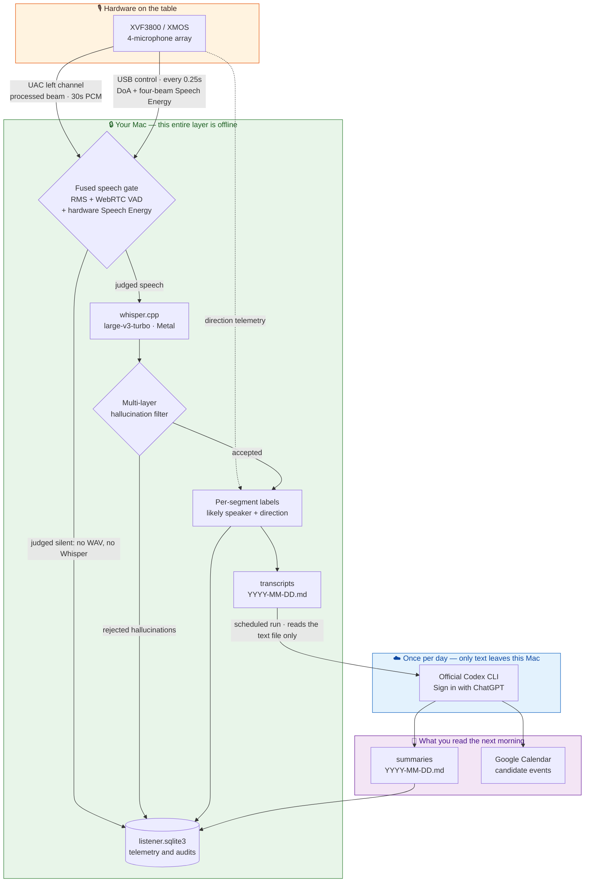

<div align="center">

# FamilyRecorder

**Turn a desktop microphone array into a privacy-first recorder for the moment.**

A reminder said in passing at home. A tricky explanation in a tutoring session. <br/>
The dream you still remember at 3 a.m. They last a few seconds, then they are gone. <br/>
FamilyRecorder keeps them.

[](LICENSE)
[](docs/getting-started.en.md)
[](pyproject.toml)
[](docs/privacy.en.md)
[](docs/daily-summary.en.md)

[繁體中文](README.md) · **English**

[Quick start](#-up-and-running-in-5-minutes) · [Use cases](#-what-you-can-build-with-it) · [Architecture](docs/architecture.en.md) · [Privacy](docs/privacy.en.md) · [Full docs](docs/README.en.md)

</div>

---

## What this is

FamilyRecorder is an always-on voice-log system for **Apple Silicon Macs**. It drives an **XVF3800 USB microphone array**, transcribes everything on-device, and produces one readable Markdown summary at a scheduled time each day.

Three things make it different from a typical cloud recorder:

| | Typical cloud recorder | FamilyRecorder |
|---|---|---|
| **Where speech recognition runs** | Audio is uploaded | 100% on your Mac (`whisper.cpp` + Metal) |
| **What the cloud receives** | Raw audio | Plain transcript text, once per day |
| **API key** | Required, metered per minute | None. It reuses your own ChatGPT sign-in |
| **Who spoke** | Usually absent, or a paid add-on | Local voice-timbre approximation **and** hardware direction of arrival |
| **After you uninstall** | Your data stays on someone else's server | One click moves everything to your own Trash |

> [!IMPORTANT]
> Get **explicit consent** from everyone who might be recorded, make it obvious that recording is happening, and follow the rules where you live. This project deliberately provides **no** covert-recording capability, and must not be used for access control, payments, parental surveillance, or any purpose that requires verified identity.

---

## 🗺️ System overview



**Raw WAV files, voice feature profiles, USB telemetry, and the SQLite database never leave this Mac.** Once a day, only the **text** of one transcript is piped to the official Codex CLI under your own ChatGPT account. This is a structural property, not a prompt instruction — the summary code path has no audio-decoding or upload implementation at all. See [Privacy and trust boundaries](docs/privacy.en.md).

For module-level diagrams, the gate decision flow, the data-model ER diagram, and the process topology, see the **[architecture document](docs/architecture.en.md)**.

---

## 💡 What you can build with it

At its core FamilyRecorder is a general-purpose **moment recorder**: listen continuously → transcribe locally → tag time, speaker, and direction → organize with a prompt you control. Swap that prompt and it becomes a different product.

### 🏠 Household voice log — fully implemented

"Remember to pick up the parcel tomorrow." "Parent-teacher meeting next Wednesday." Ten seconds later nobody remembers. FamilyRecorder turns these into a daily event timeline, per-member highlights, a to-do list, and candidate events you can add to Google Calendar with one click.

### 📚 Tutoring and study review — works today with a custom prompt

Put the array on the desk. After the session you get the full transcript, key points in chronological order, and who said what (voice timbre plus direction as two independent hints). Change the summary prompt in the menu bar to *"summarize this lesson's concepts, the mistakes the teacher emphasized, then write five review questions with answers"* and you wake up to a study sheet.

### 🌙 Dream and idea journal — works today with a custom prompt

Say one sentence when you wake at night and go back to sleep. No lights, no unlocking a phone. Silent stretches never produce a WAV and never reach Whisper, so a whole night leaves behind only the moments you actually spoke. Point the prompt at a dream-journal format and you get a timestamped log plus recurring imagery.

### 🧭 And beyond

Solo thinking-out-loud memos, daily-conversation summaries for a relative living alone, dictated notes in a home studio — anything said in the moment and wanted afterwards fits the same architecture.

> Step-by-step setup, ready-to-paste prompt templates, current capability limits, and known caveats for each scenario are in the **[use-case guide](docs/use-cases.en.md)**. Planned multi-profile support, single-session mode, and the review-question generator are in the **[roadmap](docs/roadmap.en.md)**.

---

## ✨ Core capabilities

<table>
<tr><td width="50%" valign="top">

**🎧 Capture and gating**
- Auto-selects XVF3800 / XMOS / USB arrays; will not silently fall back to the built-in mic
- Continuous 30-second chunks; 48 kHz firmware is converted to 16 kHz locally
- RMS silence gate + WebRTC VAD + hardware Speech Energy, **fused**
- Silent chunks write no WAV and never reach Whisper, but keep low-volume telemetry for later review

**🧠 On-device recognition**
- `whisper.cpp` v1.8.1 with Metal on Apple Silicon
- Download and switch between Tiny and Large v3 Turbo, including quantized builds, from the menu
- Names and domain terms enter the local prompt, and unambiguous one-character near misses are corrected

</td><td width="50%" valign="top">

**🛡️ Multi-layer hallucination filtering**
- Hardware silence can veto a low-SNR software-VAD false positive
- Adaptive noise floor plus low-frequency and narrow-tonal signatures
- Whisper token confidence, no-speech probability, compression ratio, cross-chunk similarity
- Relaxed / balanced / strict presets, or edit every threshold directly
- **No sentence is ever blacklisted**; every decision is written to an audit table

**👥 Who spoke, and from where**
- 1–8 household members, 15 seconds of enrollment each; only non-playable feature vectors are stored
- DoA angle and four-beam Speech Energy are read in parallel
- Timbre and direction stay **two independent pieces of evidence**, shown side by side

</td></tr>
<tr><td width="50%" valign="top">

**📝 Daily summary**
- Only transcript **text** is sent, through the official `codex exec`
- Event timeline, per-member highlights, decisions, tasks, key entities
- A time-output contract is appended in code, so the model never invents timestamps
- Long transcripts split only on complete segment boundaries, keeping speaker and time attached

</td><td width="50%" valign="top">

**🖥️ Native macOS experience**
- Menu-bar item: status, timed pause, open folders, switch models, summarize now
- Three per-user LaunchAgents — no root daemons
- Google Calendar candidates: confirm one by one, or opt in once for automatic creation
- **One-click uninstall**: remove the program only, or move data to the Trash as well

</td></tr>
</table>

---

## 🔐 The privacy promise

| Data | Stays local | Leaves this Mac |
|---|:---:|:---:|
| Raw WAV audio | ✅ Always | ❌ Never |
| Voice feature profiles | ✅ Always (mode `0600`) | ❌ Never |
| DoA angles and Speech Energy | ✅ Always | ❌ Never |
| SQLite database and audit rows | ✅ Always | ❌ Never |
| Text rejected by the hallucination filter | ✅ Always | ❌ Never |
| Transcript **text** | ✅ | ⚠️ Once a day, to your own ChatGPT account |

- **No OpenAI API key.** It reuses the official Codex CLI's "Sign in with ChatGPT" session. FamilyRecorder never opens that credential file and never copies cookies or tokens.
- Every Codex invocation is `--ephemeral`, `--sandbox read-only`, runs in an empty temporary working directory, ignores user config and project rules, and the prompt forbids tool use and instructions embedded in the transcript.
- The transcript is piped over stdin, so it never appears in process arguments.
- Transcript text can still contain sensitive content and household events. **Agree with your family before enabling cloud summaries.**

Full data flow and threat model: **[Privacy and trust boundaries](docs/privacy.en.md)**.

---

## 🚀 Up and running in 5 minutes

### What you need

- Apple Silicon Mac (`arm64`), macOS 13 or newer
- A [reSpeaker XVF3800 USB 4-Mic Array](https://github.com/respeaker/reSpeaker_XVF3800_USB_4MIC_ARRAY) (VID `0x2886` / PID `0x001A`)
- 2–4 GB of free space for the program, models, and build; recorded data is separate
- For daily summaries: a ChatGPT account with Codex access. **No API key.**

### Option 1: graphical DMG install (recommended)

Download the latest `FamilyRecorder-*-arm64.dmg` and its `.sha256` from [GitHub Releases](https://github.com/pcpcchen-coder/FamilyRecorder/releases), verify the hash, open the DMG, run "安裝 FamilyRecorder.app", pick a Whisper model, and install.

### Option 2: from source

```bash
git clone https://github.com/pcpcchen-coder/FamilyRecorder.git
cd FamilyRecorder
./scripts/install_mac.sh      # Python env, whisper.cpp with Metal, model, default config
./scripts/install_menubar.sh  # native menu-bar app and uninstaller
```

### Then

```bash
RUNTIME="$HOME/Library/Application Support/FamilyRecorder"
CONFIG="$HOME/.config/familyrecorder/config.yaml"

"$RUNTIME/venv/bin/family-recorder" --config "$CONFIG" list-devices          # is the XVF3800 visible
"$RUNTIME/venv/bin/family-recorder" --config "$CONFIG" doctor                # full health check
"$RUNTIME/venv/bin/family-recorder" --config "$CONFIG" diagnose-beamforming  # confirm the processed beam
```

Once a single capture passes acceptance, install the resident jobs:

```bash
./scripts/install_launchd.sh          # resident listener
./scripts/install_daily_summary.sh    # daily summary schedule
```

> Step-by-step instructions, including the macOS microphone grant and first hardware bring-up, are in the **[getting-started guide](docs/getting-started.en.md)**.

---

## 📄 What the output looks like

**Transcript** `transcripts/2026-08-20.md`:

```markdown
### 19:40:07–19:40:12 — 可能：家人二（87%） — 方向：左側 92°；穩定度 80%

明天記得去拿包裹，九點前要出門。
```

**Daily summary** `summaries/2026-08-20.md`:

```markdown
## 事件時間軸

- 約 19:40｜可能說話者：家人二｜來源方向：左側 92°：提到明天要拿包裹，並希望九點前出門。
```

Note the wording. **"可能說話者" means *likely speaker*, never *verified identity*.** Times are rounded to the minute and prefixed with 約 (*approximately*). Speaker labels come from local timbre similarity; direction is a source angle, not a name. Anything that cannot be traced to a source segment is marked 時間不明 (*time unknown*) rather than backfilled with the summary's own run time. These rules are appended by the code on every request, independent of the prompt you customize.

The built-in prompt and output are Traditional Chinese by default; both `whisper.language` and the summary prompt are configurable for other languages.

---

## 📚 Documentation

| Document | Contents |
|---|---|
| **[Getting started](docs/getting-started.en.md)** | Requirements, DMG and source installs, macOS permissions, first bring-up |
| **[Hardware and capture](docs/hardware.en.md)** | XVF3800 routing diagnosis, direction calibration, Speech Energy, A/B/C placement test |
| **[Configuration reference](docs/configuration.en.md)** | Every `config.yaml` field, its default, and tuning advice |
| **[Daily summary and calendar](docs/daily-summary.en.md)** | Summary contents, time contract, Codex boundary, Google Calendar candidates |
| **[Speakers and direction](docs/speakers.en.md)** | Enrollment, similarity thresholds, how timbre and direction are combined |
| **[Menu bar and services](docs/menu-bar.en.md)** | Every menu action, the three LaunchAgents, one-click uninstall |
| **[Data and SQLite](docs/data-model.en.md)** | Directory layout, every table and column, ER diagram |
| **[CLI reference](docs/cli.en.md)** | All commands, flags, and when to use them |
| **[Privacy and trust boundaries](docs/privacy.en.md)** | Data flow, threat model, explicit non-goals, consent and compliance |
| **[Architecture](docs/architecture.en.md)** | Module diagrams, gate decision flow, sequence diagrams, process topology |
| **[Use-case guide](docs/use-cases.en.md)** | Household, tutoring, dream-journal setups and prompt templates |
| **[Roadmap](docs/roadmap.en.md)** | Planned features and design direction |
| **[Troubleshooting](docs/troubleshooting.en.md)** | Symptom-oriented fixes |
| **[Development](docs/development.en.md)** | Local development, tests, the 31-item hardware acceptance list, building the DMG |

---

## 🧪 Project status

Current version **0.14.4**. The household voice-log path has been in continuous real-world use. Capture, recognition, hallucination filtering, speaker labels, direction, summarization, and uninstall all have isolated tests, and CI runs `ruff` and `pytest` on every pull request.

Public DMGs target Apple Silicon and macOS 13+ and are **ad-hoc signed, not notarized with an Apple Developer ID**. If Gatekeeper blocks the first launch, right-click the installer app in Finder and choose Open, after verifying the download source and SHA-256.

---

## 🤝 Contributing

Issues and pull requests are welcome, especially: support for other microphone arrays, prompt templates for new use cases, reports from non-Chinese language setups, and documentation translations.

Start with the **[contributing guide](CONTRIBUTING.en.md)**. Report security problems through the **[security policy](SECURITY.en.md)** rather than a public issue.

## 📜 License

[MIT License](LICENSE).

FamilyRecorder builds on [whisper.cpp](https://github.com/ggml-org/whisper.cpp), [XMOS XVF3800](https://www.xmos.com/documentation/XM-014888-PC/html/modules/fwk_xvf/doc/user_guide/02_setting_up_the_hardware.html), [Seeed reSpeaker XVF3800 Host Control](https://github.com/respeaker/reSpeaker_XVF3800_USB_4MIC_ARRAY/blob/master/host_control/README.md), and the official [Codex CLI](https://learn.chatgpt.com/docs/non-interactive-mode). Thank you to those projects.

---

<div align="center">
<sub>Recording affects everyone in the room. Get consent before you install.</sub>
</div>
