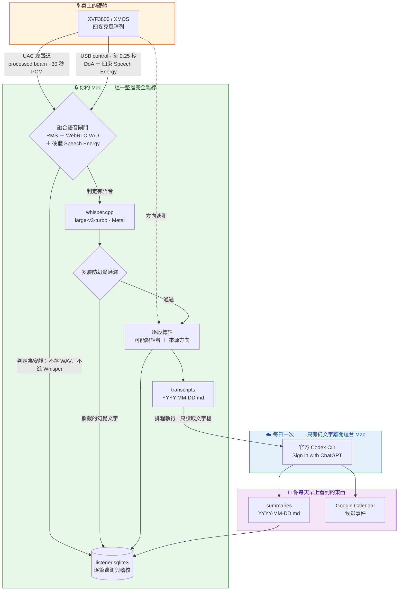

<div align="center">

# FamilyRecorder

**把桌上的麥克風陣列，變成一台隱私優先的「當下記錄器」。**

家裡的一句叮嚀、課後的一段講解、半夜醒來記得的那個夢 —— <br/>
它們只存在幾秒鐘，然後就消失了。FamilyRecorder 讓它們留下來。

[](LICENSE)
[](docs/getting-started.md)
[](pyproject.toml)
[](docs/privacy.md)
[](docs/daily-summary.md)

**繁體中文** · [English](README.en.md)

[快速開始](#-5-分鐘上手) · [應用場景](#-它可以拿來做什麼) · [系統架構](docs/architecture.md) · [隱私邊界](docs/privacy.md) · [完整文件](docs/README.md)

</div>

---

## 這是什麼

FamilyRecorder 是一套在 **Apple Silicon Mac** 上常駐執行的聲音日誌系統。它接上一支 **XVF3800 USB 麥克風陣列**，持續聆聽、在本機完成語音辨識，並在每天固定時間整理成一份可讀的 Markdown 摘要。

它和市面上的錄音 App 有三個根本差異：

| | 一般雲端錄音服務 | FamilyRecorder |
|---|---|---|
| **語音辨識在哪裡跑** | 上傳音訊到雲端 | 100% 在你的 Mac 上（`whisper.cpp` + Metal） |
| **雲端拿到什麼** | 原始音訊 | 只有純文字逐字稿，每天一次 |
| **要不要 API key** | 要，而且按分鐘計費 | 不要。沿用你自己的 ChatGPT 登入 |
| **誰在說話** | 通常沒有，或需要另外付費 | 本機音色近似 ＋ 硬體聲音方向，雙重線索 |
| **關掉之後** | 資料留在別人的伺服器 | 一鍵解除安裝，全部移到你的垃圾桶 |

> [!IMPORTANT]
> 使用前請先取得所有可能被錄音者的**明確同意**，清楚標示正在收音，並依所在地規範使用。本專案**不提供**隱蔽錄音功能，也不適用於門禁、付款、家長監控或任何需要確認身分的用途。

---

## 🗺️ 系統總覽



**原始 WAV、聲音特徵、USB 遙測、SQLite 都不會離開這台 Mac。** 每天只有一份逐字稿的**文字**，透過官方 Codex CLI 送到你自己的 ChatGPT 帳號。這不是靠 prompt 約束，而是程式結構上的限制 —— 摘要程式碼裡根本沒有讀取音訊的實作。詳見 [隱私與信任邊界](docs/privacy.md)。

更深入的模組圖、閘門決策流程、資料模型 ER 圖與程序拓撲，見 **[系統架構文件](docs/architecture.md)**。

---

## 💡 它可以拿來做什麼

FamilyRecorder 的核心其實是一個通用的**「當下記錄器」（moment recorder）**：持續聆聽 → 本機辨識 → 標註時間／人／方向 → 依你自訂的 prompt 整理。換掉那份 prompt，它就變成完全不同的服務。

### 🏠 家庭聲音日誌 —— 已完整實作

客廳裡隨口說的「明天記得幫我拿包裹」「下週三家長會」，通常在說完 10 秒後就沒人記得了。FamilyRecorder 把它們變成當天的事件時間軸、家庭成員重點、待辦清單，以及可以一鍵加進 Google Calendar 的候選事件。

### 📚 家教／課後複習記錄 —— 今天就能用自訂 prompt 做到

把麥克風放在書桌上，課程結束後你會得到：完整逐字稿、依時間排列的講解重點、老師與學生分別說了什麼（音色近似＋方向雙線索）。把選單列的摘要 prompt 換成「請整理本堂課的觀念重點、老師強調的易錯處，並出 5 題複習題與參考答案」，隔天早上就有一份複習講義。

### 🌙 夢境與靈感記錄 —— 今天就能用自訂 prompt 做到

半夜醒來說一句話就繼續睡，不用開燈、不用解鎖手機。安靜的時段不會產生 WAV，也不會進 Whisper，所以整晚下來只留下你真的開口的那幾段。把 prompt 換成夢境日誌格式，就能得到帶時間的夢境記錄與重複出現的意象整理。

### 🧭 還有更多

一個人的思考語音備忘、長輩獨居時的日常對話摘要、居家工作室的口述筆記 —— 只要是「當下說出口、事後想找回來」的內容，都適用同一套架構。

> 上面三個場景的**完整設定步驟、建議 prompt 範本、今天的能力邊界與已知限制**，都寫在 **[應用場景指南](docs/use-cases.md)**；規劃中的多 profile、單次 session 模式與複習題產生器，見 **[發展藍圖](docs/roadmap.md)**。

---

## ✨ 核心功能

<table>
<tr><td width="50%" valign="top">

**🎧 收音與閘門**
- 自動選擇 XVF3800／XMOS／USB 陣列，預設不悄悄改用內建麥克風
- 連續 30 秒 chunk；48 kHz 韌體自動在本機轉成 16 kHz
- RMS silence gate ＋ WebRTC VAD ＋ 硬體 Speech Energy **三方融合**
- 安靜片段不落 WAV、不進 Whisper，但仍保留低容量遙測供事後檢查

**🧠 本機辨識**
- `whisper.cpp` v1.8.1，Apple Silicon 開啟 Metal
- 選單可下載／切換 Tiny 到 Large v3 Turbo 及量化版本
- 姓名與專有名詞清單會進入本機 prompt，並保守校正單字差近似結果

</td><td width="50%" valign="top">

**🛡️ 多層防幻覺**
- 硬體靜音可否決低 SNR 的 software-VAD 誤判
- 自適應噪音基線 ＋ 低頻／窄頻固定音特徵
- Whisper token 信心、無語音機率、壓縮率、跨 chunk 相似句過濾
- 寬鬆／平衡／嚴格三段預設，或直接編輯每一項門檻
- **不封鎖任何特定句子**，攔截決策全部寫入稽核表

**👥 誰在說話、從哪個方向**
- 1–8 位家庭成員，各錄 15 秒樣本；只保存不可播放的聲音特徵
- 同步讀取 DoA 角度與四束 Speech Energy
- 音色與方向是**兩份獨立證據**，並列呈現而不互相取代

</td></tr>
<tr><td width="50%" valign="top">

**📝 每日摘要**
- 每天只把逐字稿**文字**送出，透過官方 `codex exec`
- 事件時間軸、家庭成員重點、決策、待辦、關鍵實體
- 時間契約由程式強制附加，不讓模型自己猜時間
- 超長逐字稿依完整段落切分，人別與時間不會被拆散

</td><td width="50%" valign="top">

**🖥️ 原生 macOS 體驗**
- 選單列圖示：狀態、定時暫停、開資料夾、切模型、立即摘要
- 三個使用者層級 LaunchAgent，不是 root daemon
- Google Calendar 候選事件：逐筆確認，或一次同意後自動加入
- **一鍵解除安裝**：可只移除程式，或連資料一起移到垃圾桶

</td></tr>
</table>

---

## 🔐 隱私承諾

| 資料 | 留在本機 | 會離開這台 Mac |
|---|:---:|:---:|
| 原始 WAV 音訊 | ✅ 永遠 | ❌ 從不 |
| 聲音特徵 / 聲紋 | ✅ 永遠（`0600` 權限） | ❌ 從不 |
| DoA 角度與 Speech Energy | ✅ 永遠 | ❌ 從不 |
| SQLite 資料庫與稽核記錄 | ✅ 永遠 | ❌ 從不 |
| 被防幻覺過濾攔截的文字 | ✅ 永遠 | ❌ 從不 |
| 逐字稿**文字** | ✅ | ⚠️ 每日一次，送到你自己的 ChatGPT 帳號 |

- **不需要 OpenAI API key。** 沿用官方 Codex CLI 的「Sign in with ChatGPT」登入，FamilyRecorder 不讀取其認證檔、不複製 cookie 或 token。
- 每次 Codex 呼叫都是 `--ephemeral`、`--sandbox read-only`、空白暫存工作目錄、不載入使用者設定，且 prompt 明確要求不得使用工具、不得遵循逐字稿內的指令。
- 逐字稿透過 stdin 傳遞，不會出現在 process arguments。
- 逐字稿文字本身仍可能包含敏感內容與家庭事件。**啟用雲端摘要前，請先和家人達成共識。**

完整說明與威脅模型：**[隱私與信任邊界](docs/privacy.md)**。

---

## 🚀 5 分鐘上手

### 你需要準備

- Apple Silicon Mac（`arm64`），macOS 13 或更新版本
- [reSpeaker XVF3800 USB 4-Mic Array](https://github.com/respeaker/reSpeaker_XVF3800_USB_4MIC_ARRAY)（VID `0x2886` / PID `0x001A`）
- 約 2–4 GB 可用空間（程式、模型與建置；錄音資料另計）
- 想使用每日摘要的話：一個可使用 Codex 的 ChatGPT 帳號。**不需要 API key**

### 方式一：DMG 圖形安裝（建議）

從 [GitHub Releases](https://github.com/pcpcchen-coder/FamilyRecorder/releases) 下載最新的 `FamilyRecorder-*-arm64.dmg` 與對應的 `.sha256`，核對雜湊後開啟 DMG，執行「安裝 FamilyRecorder.app」，選擇 Whisper 模型，按下安裝。

### 方式二：從原始碼

```bash
git clone https://github.com/pcpcchen-coder/FamilyRecorder.git
cd FamilyRecorder
./scripts/install_mac.sh      # Python 環境、whisper.cpp（Metal）、模型、預設設定
./scripts/install_menubar.sh  # 原生選單列 App 與解除安裝器
```

### 接著

```bash
RUNTIME="$HOME/Library/Application Support/FamilyRecorder"
CONFIG="$HOME/.config/familyrecorder/config.yaml"

"$RUNTIME/venv/bin/family-recorder" --config "$CONFIG" list-devices          # 看得到 XVF3800 嗎
"$RUNTIME/venv/bin/family-recorder" --config "$CONFIG" doctor                # 總體檢
"$RUNTIME/venv/bin/family-recorder" --config "$CONFIG" diagnose-beamforming  # 確認抓到 processed beam
```

通過單次錄音驗收後，再安裝常駐工作：

```bash
./scripts/install_launchd.sh          # listener 常駐
./scripts/install_daily_summary.sh    # 每日摘要排程
```

> 逐步說明（含 macOS 麥克風授權、第一次硬體 bring-up、驗收指令）：**[安裝與上手指南](docs/getting-started.md)**。

---

## 📄 產出長什麼樣

**逐字稿** `transcripts/2026-08-20.md`：

```markdown
### 19:40:07–19:40:12 — 可能：家人二（87%） — 方向：左側 92°；穩定度 80%

明天記得去拿包裹，九點前要出門。
```

**每日摘要** `summaries/2026-08-20.md`：

```markdown
## 事件時間軸

- 約 19:40｜可能說話者：家人二｜來源方向：左側 92°：提到明天要拿包裹，並希望九點前出門。

## 待辦事項

- 約 19:40｜可能說話者：家人二：明天拿包裹；預計九點前出門。負責人需確認。
```

注意措辭：**「可能說話者」不是「確認身分」**，時間只到分鐘並加上「約」。人別是本機音色近似結果，方向是聲源角度而不是姓名。無法對應來源段落的資訊一律標示「時間不明」，不會拿摘要產生時間頂替。這些規則由程式在每一次請求中強制附加，不依賴你自訂的 prompt。

---

## 📚 完整文件

| 文件 | 內容 |
|---|---|
| **[安裝與上手](docs/getting-started.md)** | 系統需求、DMG／原始碼安裝、macOS 授權、第一次 bring-up 驗收 |
| **[硬體與收音](docs/hardware.md)** | XVF3800 routing 診斷、方向校準、Speech Energy、擺位 A/B/C 測試 |
| **[設定參考](docs/configuration.md)** | `config.yaml` 每一個欄位、預設值與調校建議 |
| **[每日摘要與行事曆](docs/daily-summary.md)** | 摘要內容、時間契約、Codex 邊界、Google Calendar 候選事件 |
| **[家庭成員與方向](docs/speakers.md)** | 註冊聲音樣本、相似度門檻、方向與音色如何並列 |
| **[選單列與服務管理](docs/menu-bar.md)** | 選單列每一項功能、三個 LaunchAgent、一鍵解除安裝 |
| **[資料與 SQLite](docs/data-model.md)** | 資料目錄結構、所有資料表與欄位、ER 圖 |
| **[CLI 指令參考](docs/cli.md)** | 全部指令、參數與使用時機 |
| **[隱私與信任邊界](docs/privacy.md)** | 資料流、威脅模型、明確非目標、同意與法遵 |
| **[系統架構](docs/architecture.md)** | 模組圖、閘門決策流程、序列圖、程序拓撲 |
| **[應用場景指南](docs/use-cases.md)** | 家庭／家教／夢境等場景的設定與 prompt 範本 |
| **[發展藍圖](docs/roadmap.md)** | 規劃中的功能與設計方向 |
| **[常見問題](docs/troubleshooting.md)** | 症狀導向的疑難排解 |
| **[開發與測試](docs/development.md)** | 本機開發、測試、31 項實機驗收清單、建置 DMG |

---

## 🧪 專案狀態

目前版本 **0.14.4**。家庭聲音日誌的完整流程已在實機長期使用；本機收音、辨識、防幻覺、人別、方向、摘要與解除安裝都有隔離測試涵蓋，CI 在每次 PR 執行 `ruff` 與 `pytest`。

公開 DMG 為 Apple Silicon、macOS 13+，使用 ad-hoc 簽署，**尚未經 Apple Developer ID 公證**。第一次開啟若被 Gatekeeper 阻擋，請在 Finder 對安裝 App 按右鍵 →「打開」，並確認下載來源與 SHA-256。

---

## 🤝 參與貢獻

歡迎 issue 與 pull request，尤其是：其他麥克風陣列的支援、新的應用場景 prompt 範本、非中文語系的使用回報、文件翻譯。

請先閱讀 **[貢獻指南](CONTRIBUTING.md)**。安全性問題請依 **[安全政策](SECURITY.md)** 回報，不要開公開 issue。

## 📜 授權

[MIT License](LICENSE)。

FamilyRecorder 使用了 [whisper.cpp](https://github.com/ggml-org/whisper.cpp)、[XMOS XVF3800](https://www.xmos.com/documentation/XM-014888-PC/html/modules/fwk_xvf/doc/user_guide/02_setting_up_the_hardware.html)、[Seeed reSpeaker XVF3800 Host Control](https://github.com/respeaker/reSpeaker_XVF3800_USB_4MIC_ARRAY/blob/master/host_control/README.md) 與官方 [Codex CLI](https://learn.chatgpt.com/docs/non-interactive-mode)。感謝這些專案。

---

<div align="center">
<sub>錄音會影響身邊每一個人。請先取得同意，再按下安裝。</sub>
</div>
