# Architecture

**English** · [繁體中文](architecture.md) · [Back to docs index](README.en.md)

FamilyRecorder deliberately separates the **always-on local path** from the **scheduled cloud path**. This document explains how the two are composed, how data flows, and exactly where the trust boundary sits.

---

## Contents

- [Design principles](#design-principles)
- [Layered overview](#layered-overview)
- [Module map](#module-map)
- [Capture path: the life of a 30-second chunk](#capture-path-the-life-of-a-30-second-chunk)
- [Recognition path: Whisper and text filtering](#recognition-path-whisper-and-text-filtering)
- [Per-segment enrichment: speaker and direction](#per-segment-enrichment-speaker-and-direction)
- [Cloud summary path](#cloud-summary-path)
- [Calendar candidate state machine](#calendar-candidate-state-machine)
- [Process topology](#process-topology)
- [Menu bar control path](#menu-bar-control-path)
- [Uninstall boundary](#uninstall-boundary)
- [Trust boundary summary](#trust-boundary-summary)
- [Explicit non-goals](#explicit-non-goals)

---

## Design principles

| Principle | How it is enforced |
|---|---|
| **Boundaries must be testable, not promised in a prompt** | The summary path opens only `transcripts/YYYY-MM-DD.md`; there is no audio-decoding or upload implementation anywhere in that code path |
| **Silence should not produce data** | When the fused gate judges a chunk silent, no WAV is written and Whisper is never invoked — only low-volume telemetry remains |
| **No single sensor is authoritative** | Software VAD and hardware Speech Energy rescue and veto each other, but neither decides alone |
| **Approximate results must read as approximate** | Output always says 可能 (*likely*), 可能多人 (*possibly multiple*), or 不確定 (*uncertain*) — never a confirmed identity |
| **Degrade, never abort** | If USB telemetry is unreadable, capture and transcription continue and direction is marked unavailable |
| **Removal must be complete and recoverable** | Uninstall moves everything to the Trash rather than deleting, so the user can still undo it |

---

## Layered overview

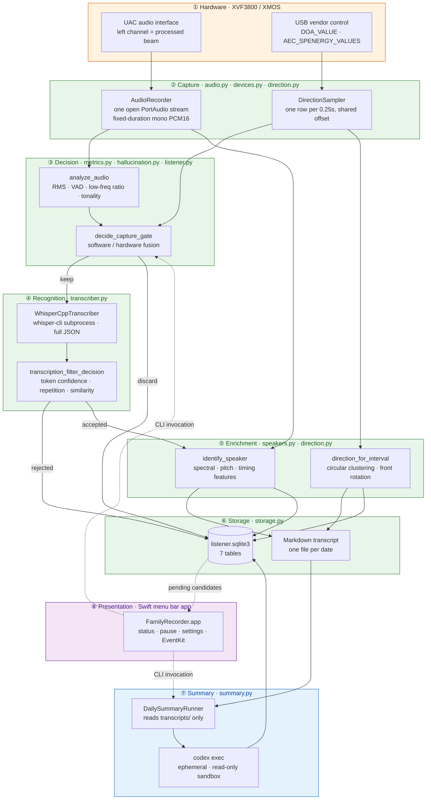

Layers ① through ⑤ are entirely offline. Layer ⑥ is the only one that reaches the network, and it sends plain text only.

---

## Module map

`src/family_recorder/` contains 18 modules, roughly 5,200 lines. Dependencies are deliberately one-directional: lower modules never import higher ones.

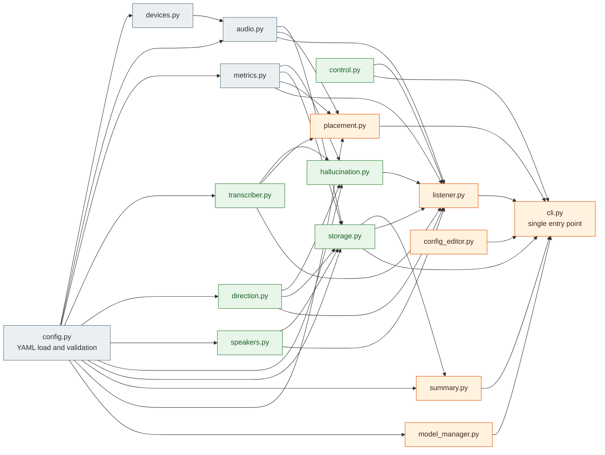

| Module | Lines | Responsibility |
|---|---:|---|
| `config.py` | 432 | YAML schema, defaults, path expansion; every other module depends on it |
| `devices.py` | 117 | Enumerate macOS input devices and score-select XVF3800 / XMOS / USB arrays |
| `audio.py` | 155 | `AudioRecorder`, downmix, resampling, WAV read/write, PCM slicing |
| `metrics.py` | 148 | RMS, SNR, WebRTC VAD speech ratio, low-frequency ratio, tonal concentration |
| `transcriber.py` | 229 | `whisper-cli` subprocess, JSON segment and token parsing, common-term correction |
| `direction.py` | 567 | XVF3800 USB control, DoA and four-beam Speech Energy, circular clustering |
| `speakers.py` | 350 | Feature extraction, profile storage, approximate speaker identification |
| `hallucination.py` | 162 | Acoustic-layer and text-layer rejection logic, adaptive noise floor |
| `control.py` | 84 | Atomic read/write of the `control.json` pause state |
| `storage.py` | 678 | SQLite schema and migrations, Markdown append, retention |
| `listener.py` | 479 | The resident loop: capture → gate → transcribe → enrich → store |
| `summary.py` | 515 | Daily summary, time/speaker/direction contracts, calendar extraction |
| `placement.py` | 197 | A/B/C placement test and CER report |
| `model_manager.py` | 217 | Whisper model catalog, download, resume, GGML validation |
| `config_editor.py` | 83 | Targeted YAML edits that preserve unrelated comments |
| `cli.py` | 777 | Every subcommand; the menu bar app touches the system only through this layer |

---

## Capture path: the life of a 30-second chunk

`AudioRecorder` selects an input and holds exactly **one** PortAudio stream open, emitting fixed-duration mono PCM16. With the default `audio.channels: 1`, CoreAudio/PortAudio captures the first (left) UAC channel.

Stereo downmix is treated as **ambiguous**: the right channel can carry ASR/AEC-residual data whose processing purpose differs from the left, and averaging the two destroys the beamformed signal. `diagnose-beamforming` reads `AUDIO_MGR_OP_L/R` without modifying the device and verifies that the left channel is category `6` processed beamformed data, or category `8`'s copy of the processed auto-selected beam.

### Gate decision order

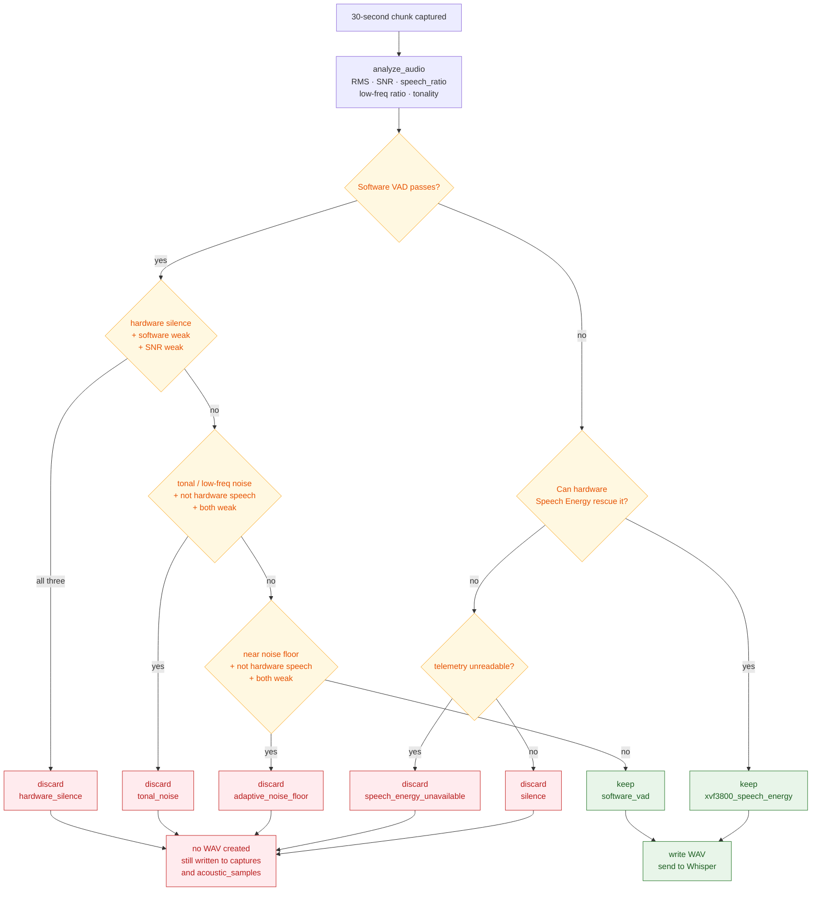

The discard labels above are abbreviated. The full `captures.gate_reason` values are `hallucination_filter:hardware_silence`, `hallucination_filter:tonal_noise`, `hallucination_filter:adaptive_noise_floor`, `software_vad; speech_energy_unavailable`, and `silence` — see [data and SQLite](data-model.en.md#possible-gate_reason-values).

Three things matter here:

1. **Hardware rescue can only push toward keeping, once**, and the chunk must still clear `speech_energy_min_rms_dbfs`, so a single non-zero hardware sample cannot push extremely faint noise into Whisper.
2. **Hardware veto requires three conditions simultaneously** (hardware silence, weak software evidence, weak SNR), so one sensor treated as ground truth cannot silently drop real speech.
3. **When USB control is temporarily unreadable**, the adaptive noise floor plus tonal/low-frequency evidence takes over and capture is never aborted.

Every completed chunk is written to `captures`, including those judged silent with no WAV; the full time series goes to `acoustic_samples`. Telemetry failures never abort UAC recording or local transcription.

---

## Recognition path: Whisper and text filtering

`WhisperCppTranscriber` invokes `whisper-cli` as a subprocess and reads the **full JSON**: segment timestamps and token probabilities are both retained, not just plain text. Decoder no-speech and log-probability thresholds are passed down to whisper.cpp; a second text-level filter runs on the result.

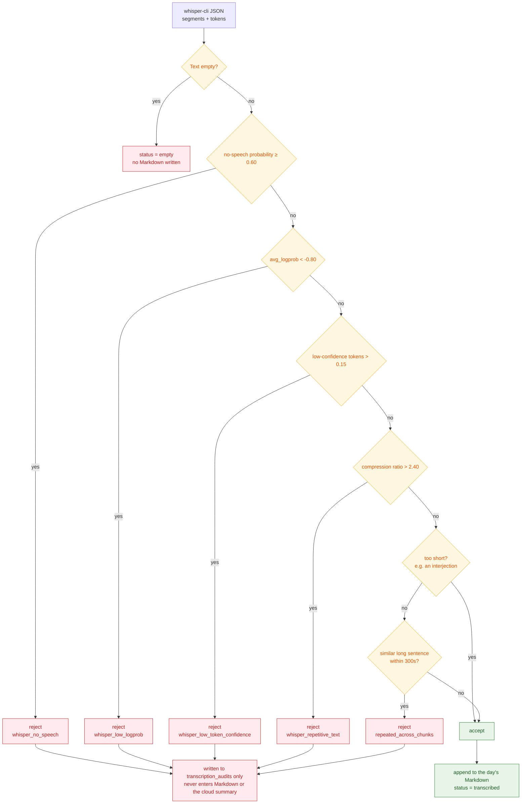

The values shown are the *balanced* preset. They can be changed through the menu bar's three presets or its advanced editor — see the [configuration reference](configuration.en.md#hallucination_filter).

**No rule blacklists any particular sentence.** Hallucinated text changes with the model and the prompt, so a blacklist goes stale quickly. Rejection is therefore based on statistical properties — confidence, repetitiveness, cross-chunk similarity — rather than literal matching.

Rejected candidate text, the decision, the reason, average log probability, low-probability token ratio, compression ratio, and similarity count all go to `transcription_audits`, so "why did that sentence not appear?" is answerable after the fact. A **failed** transcription is indexed as `failed` and keeps its WAV for diagnosis, with retention independent of transcript retention.

---

## Per-segment enrichment: speaker and direction

Whisper returns timestamps at **second-level granularity**, not one label per 30 seconds. Enrichment therefore happens per segment:

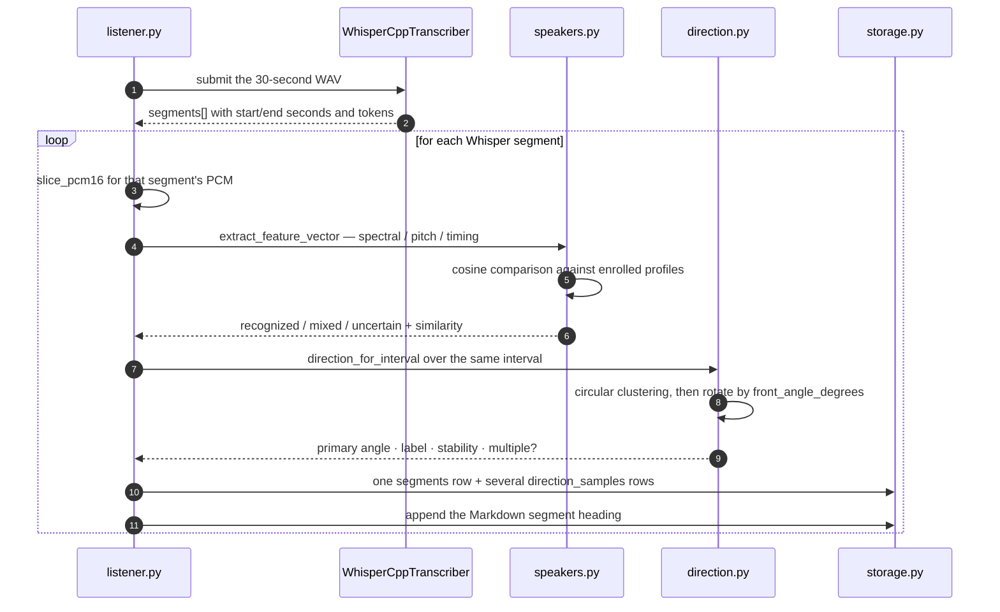

The resulting heading looks like this:

```markdown
### 19:40:07–19:40:12 — 可能：家人二（87%） — 方向：左側 92°；穩定度 80%
```

(*likely: family member 2 (87%) — direction: left 92°; stability 80%*)

### Two pieces of evidence that never substitute for each other

| | Voice timbre | Sound direction |
|---|---|---|
| **Source** | Local acoustic feature-vector comparison | XVF3800 firmware DoA |
| **Can answer** | Whether this audio **resembles** an enrolled member | What **angle** the source sits at relative to the mic |
| **Cannot answer** | Verified identity, forensic word-level voiceprints | Who it is, distance, room coordinates |
| **On failure** | `uncertain` or `mixed` | `unavailable` or `multiple` |

A stable direction can **corroborate** a voice label and reveal a change of speaker within one 30-second chunk, but it cannot map a location to a person. Two significant direction clusters are retained as `multiple` rather than collapsed onto the primary voice label. **A segment with no timbre-derived name is never assigned to a household member on direction alone.**

Enrollment audio exists only in memory and is discarded once features are computed — no WAV is ever created. Profiles are stored mode `0600` under `speaker-profiles/`. See [Speakers and direction](speakers.en.md).

---

## Cloud summary path

`DailySummaryRunner` accepts a calendar date and opens **only** the corresponding Markdown file under `transcripts/`.

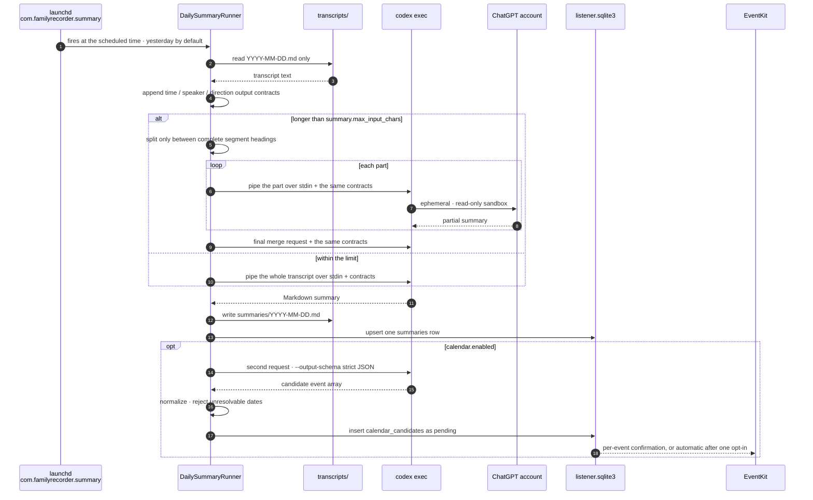

### The time contract

Transcript headings carry local chunk ranges such as `19:40:00–19:40:30`. The code appends a time-output contract to **every** request, independently of the user-configurable `summary.prompt`. It requires:

- Minute-level timestamps, prefixed with 約 (*approximately*)
- Events ordered chronologically
- An explicit 時間不明 (*time unknown*) marker when a fact cannot be traced to a source segment
- A **prohibition** on substituting the summary's own generation time for source time

Both the partial requests and the final merge carry the same contract, so chunking cannot silently discard chronology. Speaker and direction contracts work the same way: speaker and task owner must stay distinct, direction alone can never supply a missing name, and unlabeled or mixed segments cannot be assigned to a person.

### Why "text only" is testable

| Protection | Mechanism |
|---|---|
| No audio read | The `summary` code path contains no audio decoding or upload implementation |
| No voice features read | `audio/` and `speaker-profiles/` are never opened |
| Not exposed in the process list | The transcript is piped over stdin, never placed in process arguments |
| No credential file read | Only the official `codex login status` is executed; the Codex token file is never opened |
| No transcript-driven injection | The prompt states that transcript content is untrusted and forbids tool use |
| No residue | Every invocation is `--ephemeral`, `--sandbox read-only`, in an empty temporary working directory, ignoring user config and project rules |

---

## Calendar candidate state machine

Calendar extraction is a **separate second request** issued only after the human-readable summary succeeds. It uses `--output-schema` with a strict JSON Schema and receives only summary and transcript text. **That request never creates an external event.**

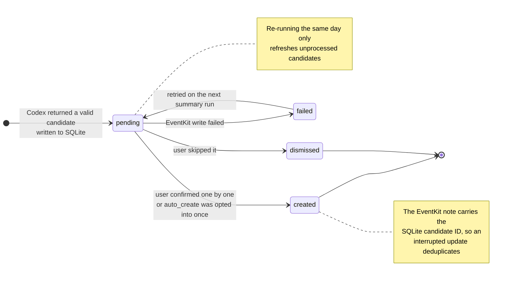

- A date with no time becomes an all-day candidate; a date that cannot be resolved is rejected rather than guessed.
- The default path requires **per-event confirmation**. `auto_create` requires one explicit opt-in, after which the continuously running menu app notices `pending` rows and writes them through EventKit.
- Every EventKit note carries the SQLite candidate ID, so an interrupted status update can be deduplicated before retry.
- A failed or malformed extraction leaves **existing pending candidates untouched** and adds a visible warning to the Markdown summary.

---

## Process topology

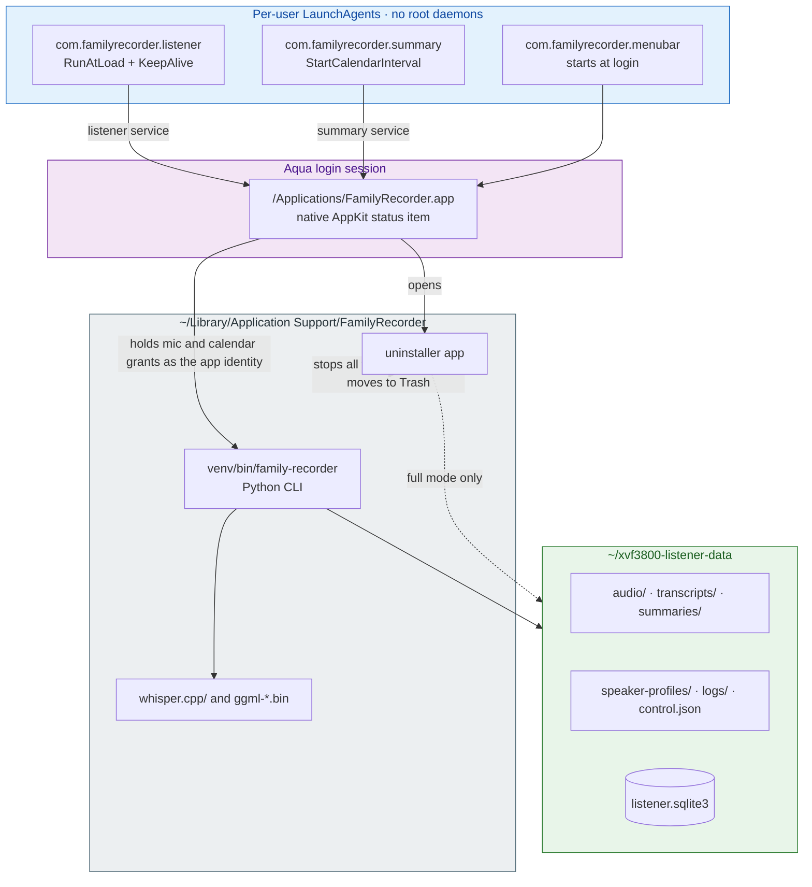

All three jobs are **per-user LaunchAgents, not root daemons**. No API key or Codex token is placed in launchd environment variables; the summary job provides only `HOME` so the official CLI can locate its own saved login.

All three are associated with the **same app** in `/Applications`, avoiding the Spotlight/TCC identity-cache inconsistency that hidden or user-level paths cause. macOS therefore shows a single `FamilyRecorder.app` under Privacy & Security → Microphone, rather than `python3.12`.

---

## Menu bar control path

The Swift menu bar app **never manipulates system state directly**. It invokes the installed `family-recorder` CLI for status, pause/resume, targeted YAML edits, summaries, diagnostics, and intentional speaker enrollment.

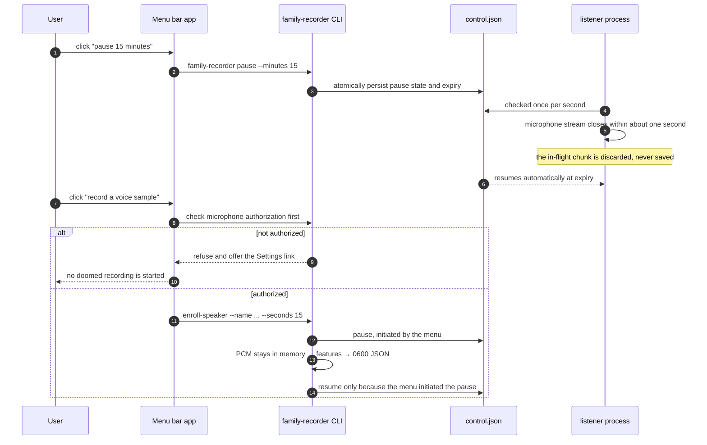

- Pause state lives in `data_dir/control.json`, **not just UI memory**, so restarting the menu bar app never accidentally resumes recording.
- Whisper model choices are discovered from **already-downloaded** `ggml-*.bin` files, not a hardcoded list.
- Targeted config edits (`config_editor.py`) preserve unrelated YAML comments and values.
- Changing hallucination thresholds or the local model restarts the listener; the Codex summary model is read fresh on every summary run and needs no restart.

---

## Uninstall boundary

The menu bar does **not** delete its own runtime inline. It opens a **separately signed native uninstaller**, which can therefore stop all three LaunchAgents before moving the running menu app, Python environment, whisper.cpp checkout, and models.

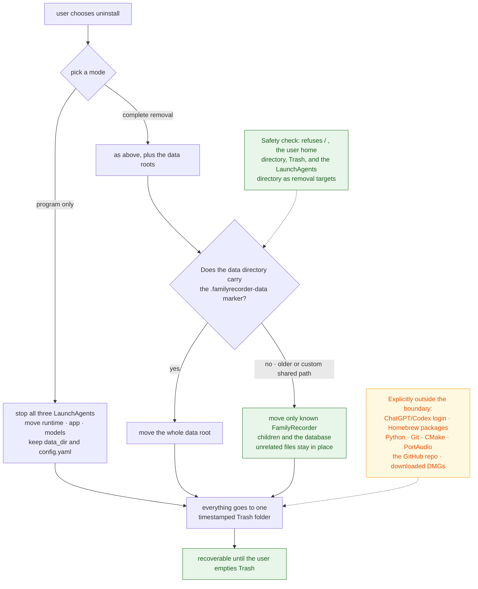

---

## Trust boundary summary

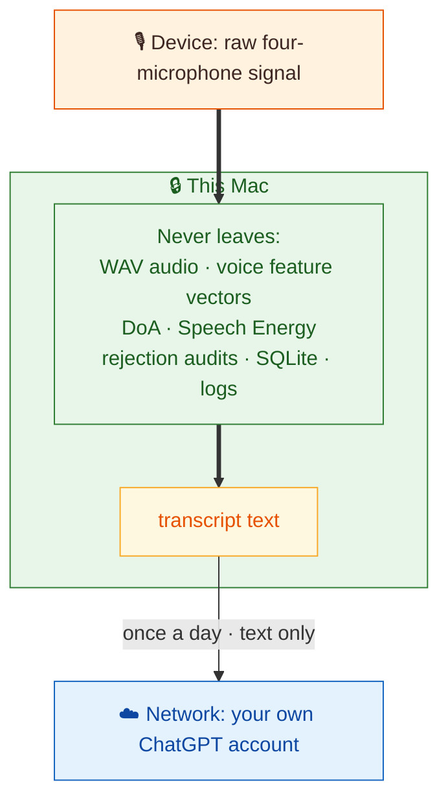

The four `-.-x` edges mean **never leaves this Mac**. The only thing that crosses the boundary is transcript text, once per day. Full threat model in [Privacy and trust boundaries](privacy.en.md).

---

## Explicit non-goals

These are not "not yet built" — they are **deliberately excluded**:

- ❌ Biometric-grade speaker identification, authentication, or word-level diarization
- ❌ Treating DoA as identity, distance, room coordinates, or proof that one person spoke an entire segment
- ❌ Covert recording
- ❌ Live cloud transcription
- ❌ Uploading or remotely backing up raw audio
- ❌ Acting on inferred tasks or reminders
- ❌ A web dashboard

---

## Further reading

- [Data and SQLite](data-model.en.md) — every table and column
- [Privacy and trust boundaries](privacy.en.md) — threat model and consent
- [Configuration reference](configuration.en.md) — the parameters behind every decision point above
- [Use-case guide](use-cases.en.md) — how the same architecture becomes a different service
