# 系統架構

[English](architecture.en.md) · **繁體中文** · [返回文件索引](README.md)

FamilyRecorder 刻意把**常駐的本機路徑**與**排程的雲端路徑**分開。這份文件說明兩者如何組成、資料怎麼流動，以及信任邊界落在哪裡。

---

## 目錄

- [設計原則](#設計原則)
- [分層總覽](#分層總覽)
- [模組地圖](#模組地圖)
- [收音路徑：30 秒 chunk 的一生](#收音路徑30-秒-chunk-的一生)
- [辨識路徑：Whisper 與文字防幻覺](#辨識路徑whisper-與文字防幻覺)
- [逐段標註：人別與方向](#逐段標註人別與方向)
- [雲端摘要路徑](#雲端摘要路徑)
- [行事曆候選事件狀態機](#行事曆候選事件狀態機)
- [程序拓撲](#程序拓撲)
- [選單列控制路徑](#選單列控制路徑)
- [解除安裝邊界](#解除安裝邊界)
- [信任邊界總結](#信任邊界總結)
- [明確非目標](#明確非目標)

---

## 設計原則

| 原則 | 具體做法 |
|---|---|
| **邊界要能被測試，而不是靠 prompt 承諾** | 摘要程式只開啟 `transcripts/YYYY-MM-DD.md`，程式碼中沒有任何音訊解碼或上傳實作 |
| **安靜不該產生資料** | 融合閘門判定為安靜時不建立 WAV、不呼叫 Whisper；只留低容量遙測 |
| **兩個感測器不能互相取代** | software VAD 與硬體 Speech Energy 互為救援與否決，但單一感測器不能獨斷 |
| **近似結果要說成近似** | 一律使用「可能說話者」「可能多人」「不確定」，不輸出確定身分 |
| **失敗要降級，不要中止** | USB 遙測讀不到時，錄音與轉錄繼續，方向標成「無法讀取」 |
| **可以完整移除** | 解除安裝把所有內容移到垃圾桶而不是直接刪除，使用者仍可復原 |

---

## 分層總覽

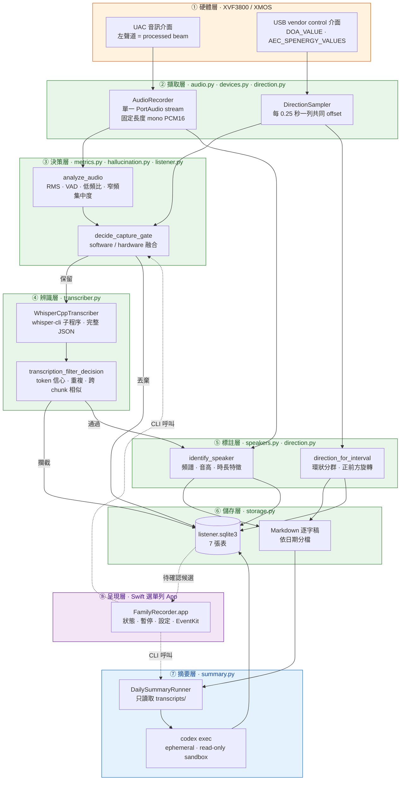

①–⑤ 完全離線；⑥ 是唯一會對外連線的層，且只送純文字。

---

## 模組地圖

`src/family_recorder/` 共 18 個模組，約 5,200 行。相依關係刻意保持單向：底層模組不認識上層。

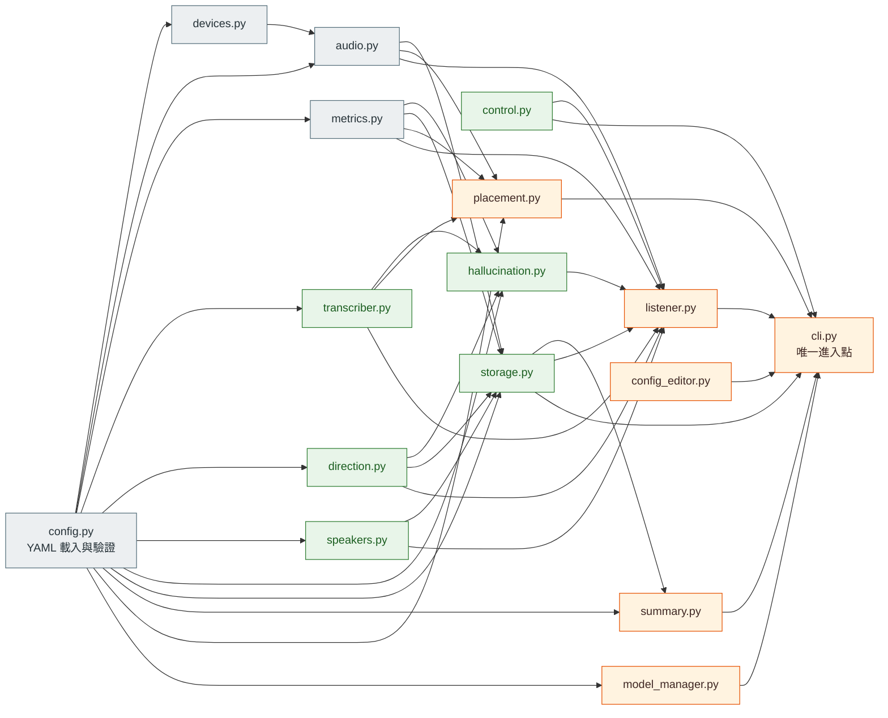

| 模組 | 行數 | 職責 |
|---|---:|---|
| `config.py` | 432 | YAML schema、預設值、路徑展開；所有其他模組的相依起點 |
| `devices.py` | 117 | 列舉 macOS 輸入裝置並評分挑選 XVF3800／XMOS／USB 陣列 |
| `audio.py` | 155 | `AudioRecorder`、downmix、重新取樣、WAV 讀寫、PCM 切片 |
| `metrics.py` | 148 | RMS、SNR、WebRTC VAD speech ratio、低頻比、窄頻集中度 |
| `transcriber.py` | 229 | `whisper-cli` 子程序呼叫、JSON 段落與 token 解析、常用字詞校正 |
| `direction.py` | 567 | XVF3800 USB control、DoA 與四束 Speech Energy、環狀分群 |
| `speakers.py` | 350 | 特徵抽取、profile 儲存、近似人別判定 |
| `hallucination.py` | 162 | 聲學層與文字層的攔截判斷、自適應噪音基線 |
| `control.py` | 84 | `control.json` 暫停狀態的原子讀寫 |
| `storage.py` | 678 | SQLite schema／migration、Markdown 附加、retention |
| `listener.py` | 479 | 常駐主迴圈：擷取→閘門→轉錄→標註→儲存 |
| `summary.py` | 515 | 每日摘要、時間／人別／方向契約、行事曆候選擷取 |
| `placement.py` | 197 | A/B/C 擺位測試與 CER 報告 |
| `model_manager.py` | 217 | Whisper 模型清單、下載、續傳、GGML 驗證 |
| `config_editor.py` | 83 | 保留註解的目標式 YAML 編輯 |
| `cli.py` | 777 | 全部子指令；選單列 App 只透過這一層操作系統 |

---

## 收音路徑：30 秒 chunk 的一生

`AudioRecorder` 選定輸入後只開啟**一條** PortAudio stream，持續產出固定長度的 mono PCM16。預設 `audio.channels: 1`，CoreAudio／PortAudio 因此擷取第一個（左）UAC 聲道。

立體聲 downmix 被視為**語意不明**：右聲道可能承載 ASR/AEC residual，與左聲道的處理目的不同，平均混合會破壞 beamformed 訊號。`diagnose-beamforming` 在不修改裝置的前提下讀回 `AUDIO_MGR_OP_L/R`，確認左聲道是 category `6` 的 processed beamformed，或 category `8` 對 processed auto-selected beam 的複製。

### 融合閘門的判定順序

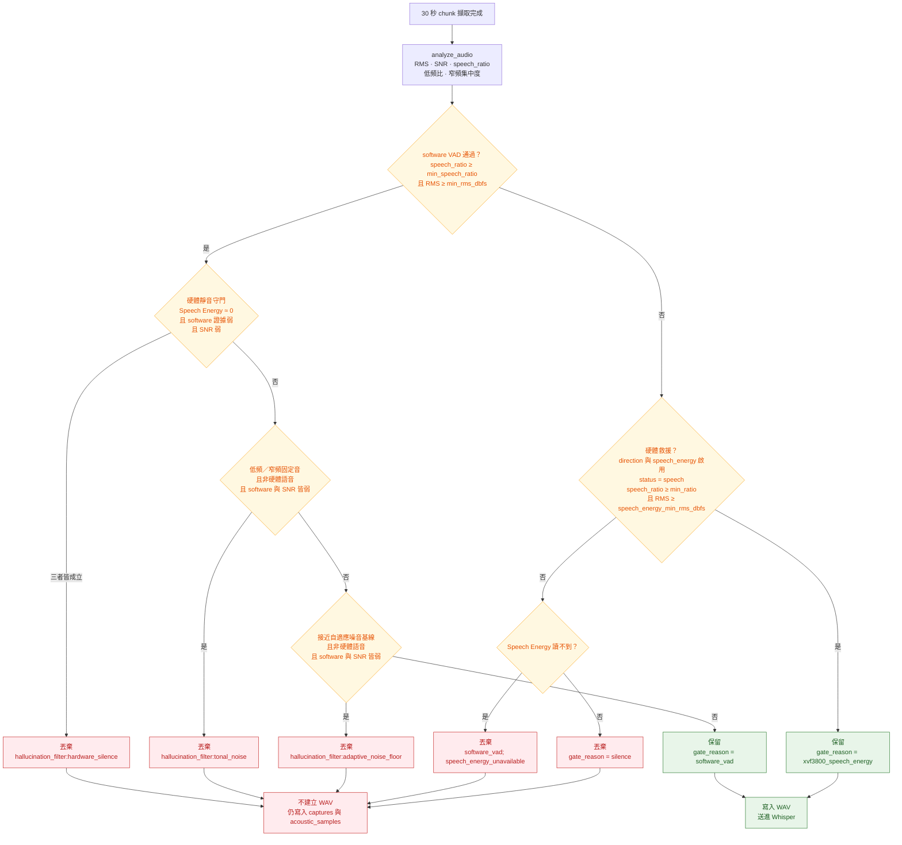

三個重點：

1. **硬體救援只能往「保留」的方向作用一次**，且仍必須通過 `speech_energy_min_rms_dbfs`，避免單一硬體非零值把極低音量雜訊送進 Whisper。
2. **硬體否決需要三個條件同時成立**（硬體靜音、software 證據弱、SNR 弱），避免把單一感測器當成絕對真相而漏字。
3. **USB control 暫時讀不到時**，自適應噪音基線與低頻／窄頻特徵接手，錄音不中斷。

每一個完成擷取的 chunk 都會寫入 `captures`，包含被判為安靜、沒有 WAV 的那些；完整時間序列寫入 `acoustic_samples`。遙測失敗永遠不會中止 UAC 錄音或本機轉錄。

---

## 辨識路徑：Whisper 與文字防幻覺

`WhisperCppTranscriber` 以子程序呼叫 `whisper-cli`，讀取**完整 JSON**：段落時間戳與 token 機率都會保留，而不是只取純文字。解碼器的 no-speech／log-probability 門檻直接傳給 whisper.cpp；回傳後再做第二層文字過濾。

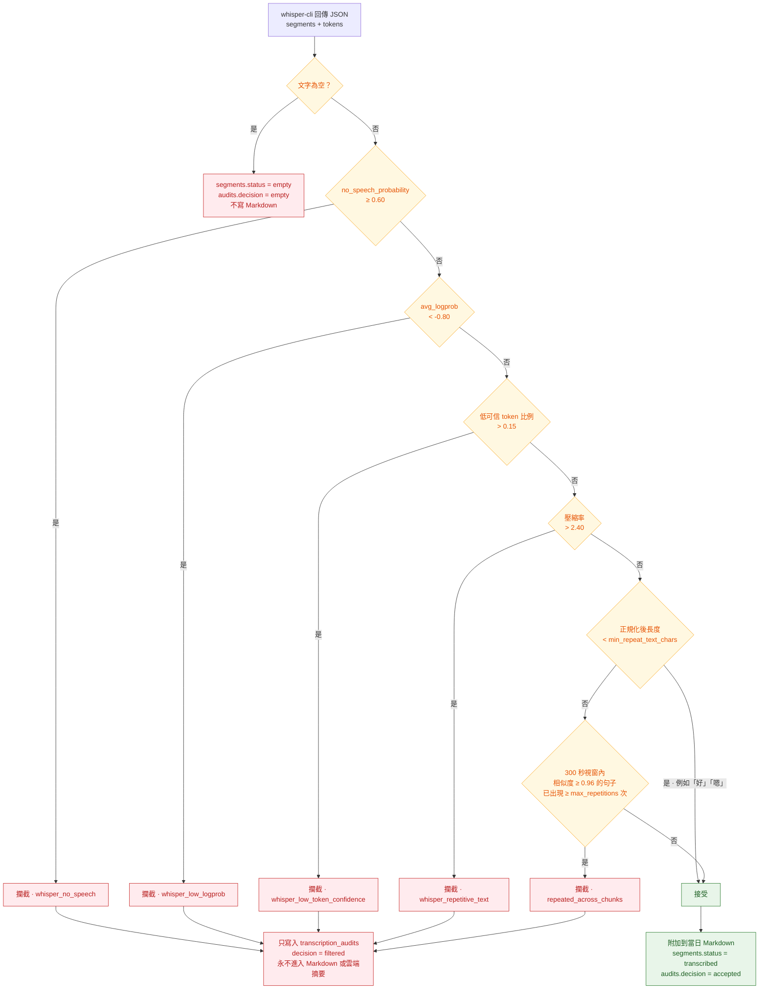

門檻數值為「平衡」預設，可由選單列的三段預設或進階編輯器調整，詳見 [設定參考](configuration.md#hallucination_filter)。

**這些規則不封鎖任何特定句子。** 幻覺文字會隨模型與提示改變，黑名單很快就失效；因此攔截依據的是統計特徵（信心、重複度、跨片段相似），而不是字面比對。

被攔截的原始候選文字、決策、原因、平均 log probability、低可信 token 比例、壓縮率與相似次數都寫入 `transcription_audits`，方便事後回查「為什麼這句沒有出現」。轉錄**失敗**的 chunk 索引為 `failed` 並保留 WAV 供排查，其 retention 與逐字稿獨立。

---

## 逐段標註：人別與方向

Whisper 回傳的是**數秒級**的段落時間戳，不是整個 30 秒一個標籤。標註因此在段落層級進行：

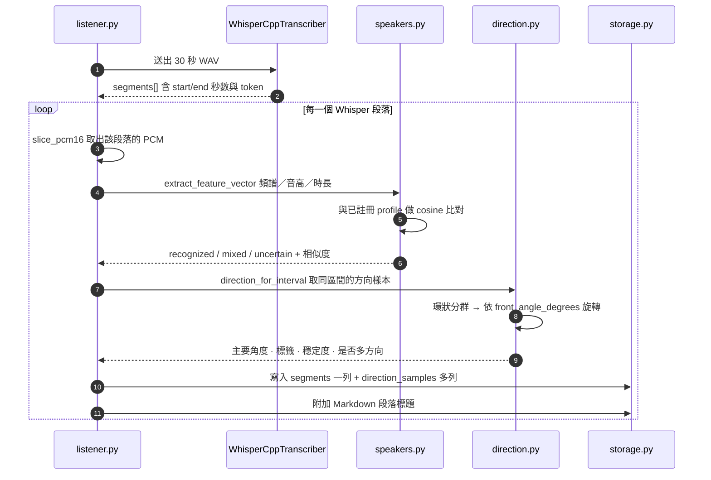

產出的標題格式：

```markdown
### 19:40:07–19:40:12 — 可能：家人二（87%） — 方向：左側 92°；穩定度 80%
```

### 兩份證據，不互相取代

| | 音色人別 | 聲音方向 |
|---|---|---|
| **來源** | 本機聲學特徵向量比對 | XVF3800 韌體的 DoA |
| **能回答** | 這段聲音**像不像**某位已註冊成員 | 聲源相對麥克風在**哪個角度** |
| **不能回答** | 確認身分、逐字聲紋鑑識 | 是誰、距離、房間座標 |
| **失敗時** | `uncertain` 或 `mixed` | `unavailable` 或 `multiple` |

穩定的方向可以**佐證**音色判斷，也能揭露同一個 30 秒內的人員變動；但方向不能把位置對應到人。兩個明顯的方向叢集會保留為 `multiple`，不會被收斂成主要的那個人。**沒有音色姓名的片段，絕不會只靠方向指定某位家人。**

註冊音訊只存在記憶體中，產生特徵後即丟棄，不會建立 WAV；特徵以權限 `0600` 保存在 `speaker-profiles/`。詳見 [家庭成員與方向](speakers.md)。

---

## 雲端摘要路徑

`DailySummaryRunner` 接受一個日曆日期，然後**只**開啟 `transcripts/` 底下對應的那一個 Markdown 檔。

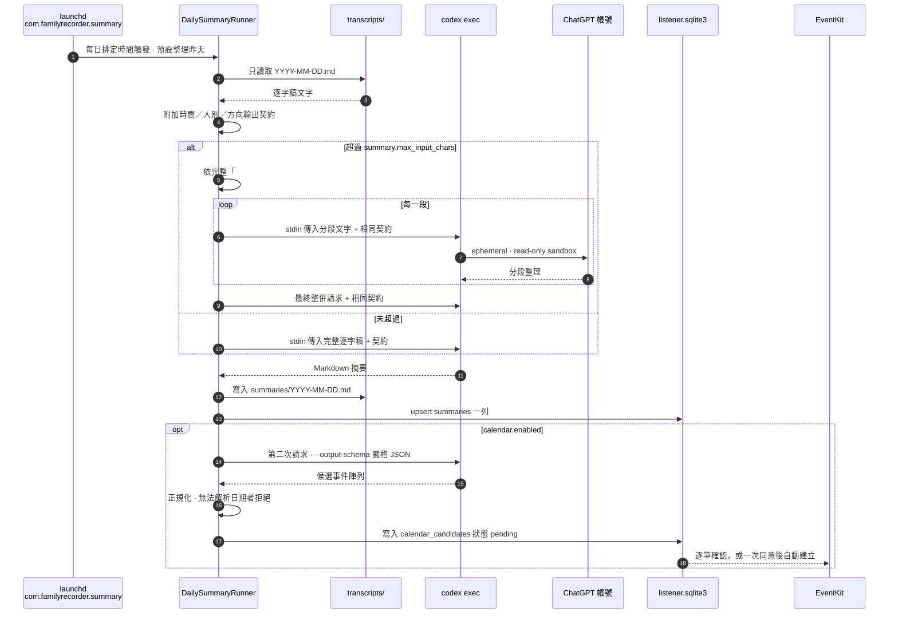

### 時間契約

逐字稿標題帶有本地 chunk 區間（例如 `19:40:00–19:40:30`）。程式在**每一次**請求中附加一份時間輸出契約，與使用者可自訂的 `summary.prompt` 無關。它要求：

- 時間只到分鐘，並加上「約」
- 事件依時間先後排列
- 無法對應來源段落者標示「時間不明」
- **禁止**用摘要產生時間頂替來源時間

分段與最終整併都會再帶上同一份契約，所以切分不會靜默地丟掉時序。人別契約與方向契約同理：說話者與待辦負責人必須分開、方向不能補上缺少的姓名、未標記或混合的片段不能被指派給任何人。

### 為什麼「只有文字」是可測試的

| 保護 | 做法 |
|---|---|
| 不讀音訊 | `summary` 指令的程式路徑沒有音訊解碼或上傳實作 |
| 不讀聲音特徵 | 不開啟 `audio/` 或 `speaker-profiles/` |
| 不外洩到 process 清單 | 逐字稿透過 stdin 傳遞，不放進 process arguments |
| 不讀認證檔 | 只執行官方 `codex login status`，不開啟 Codex 的 token 檔 |
| 不受逐字稿注入 | prompt 明確要求把逐字稿視為不可信輸入、不得使用工具 |
| 不留下工作痕跡 | 每次呼叫都是 `--ephemeral`、`--sandbox read-only`、空白暫存工作目錄，且忽略使用者設定與專案規則 |

---

## 行事曆候選事件狀態機

行事曆擷取是摘要成功之後的**第二次獨立請求**，使用 `--output-schema` 搭配嚴格 JSON Schema，輸入只有摘要與逐字稿文字。**這次請求本身不會建立任何外部事件。**

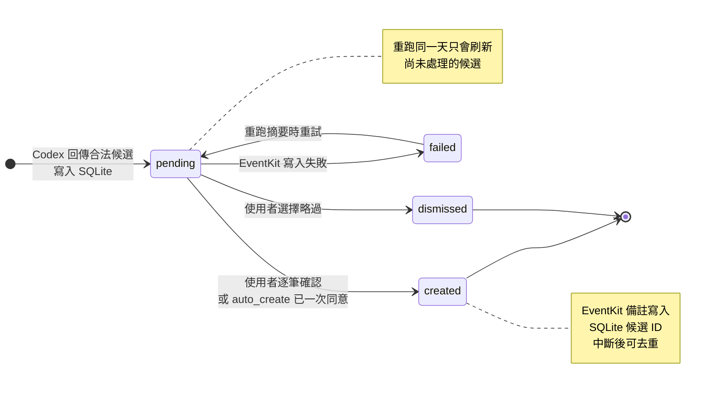

- 日期明確但沒有時間 → 全天候選；日期無法解析 → 直接拒絕，不猜。
- 預設路徑要求**逐筆確認**；`auto_create` 需要一次明確 opt-in，之後由常駐的選單列程式注意到 `pending` 列並透過 EventKit 寫入。
- 每則 EventKit 備註都帶有 SQLite 候選 ID，所以狀態更新中斷後可在重試前去重。
- 擷取失敗或格式錯誤時，**既有的 pending 候選不受影響**，並在 Markdown 摘要中加上明顯警告。

---

## 程序拓撲

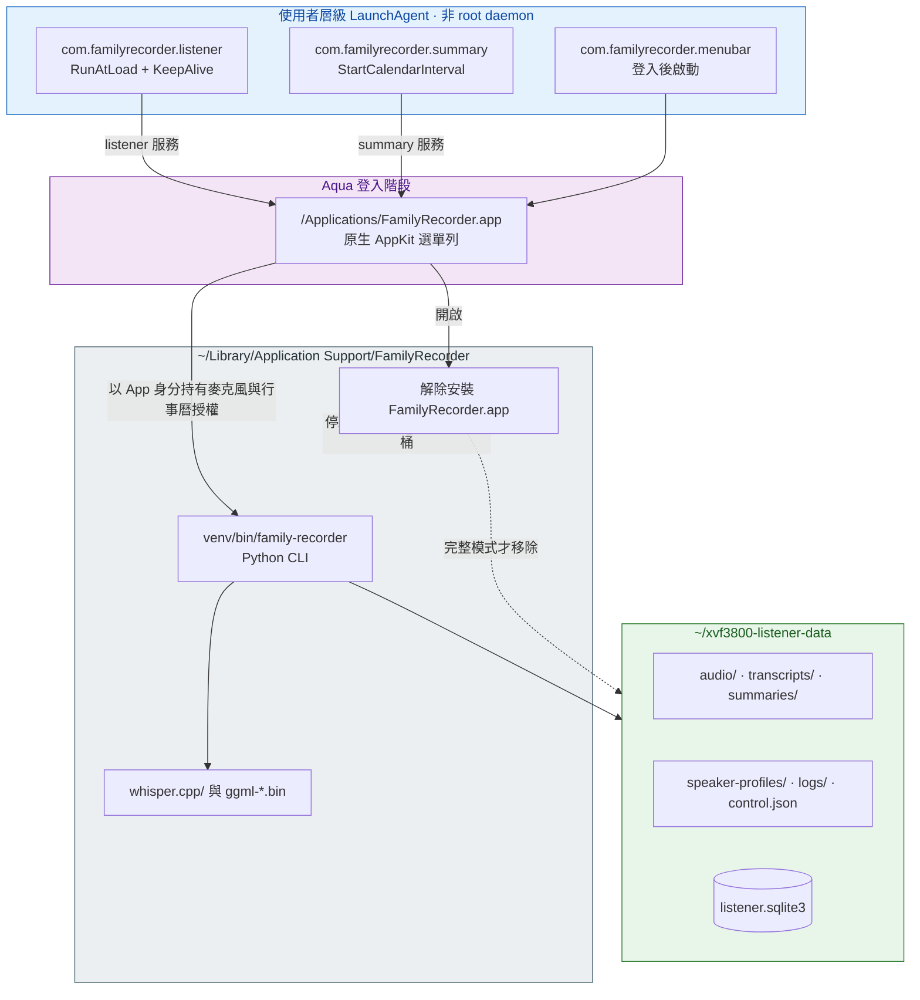

三個工作**全部是使用者層級 LaunchAgent**，不是 root daemon。launchd 環境變數中沒有任何 API key 或 Codex token；summary 工作只提供 `HOME`，讓官方 CLI 自己找到它保存的登入。

三個工作都關聯到 `/Applications` 裡的**同一個 App**，避免隱藏路徑或使用者層級路徑造成 Spotlight／TCC 身分快取不一致。macOS 因此在「隱私權與安全性 → 麥克風」顯示單一 `FamilyRecorder.app`，而不是 `python3.12`。

---

## 選單列控制路徑

Swift 選單列 App **不直接操作系統狀態**；它呼叫已安裝的 `family-recorder` CLI 來取得狀態、暫停／恢復、做目標式 YAML 編輯、產生摘要、執行診斷與註冊聲音樣本。

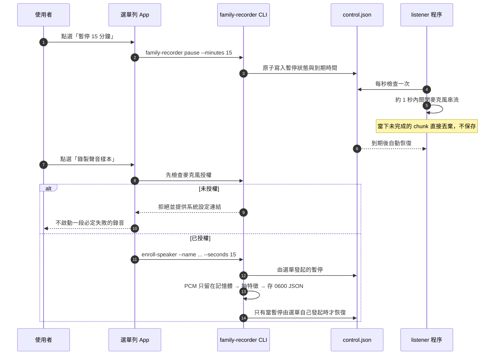

- 暫停狀態存在 `data_dir/control.json`，**不是只存在 UI 記憶體**；選單列程式重啟不會意外恢復錄音。
- Whisper 模型選項從**實際已下載**的 `ggml-*.bin` 探索而來，不是硬編清單。
- 目標式 config 編輯（`config_editor.py`）保留無關的 YAML 註解與值。
- 更動防幻覺門檻或本機模型會重啟 listener；Codex 摘要模型則在每次摘要執行時重新讀取，不需重啟。

---

## 解除安裝邊界

選單列**不會**內嵌刪除自己的 runtime，而是打開一個**獨立簽署的原生解除安裝器**。這樣它才能先停掉三個 LaunchAgent，再移動正在執行的選單列 App、Python 環境、whisper.cpp checkout 與模型。

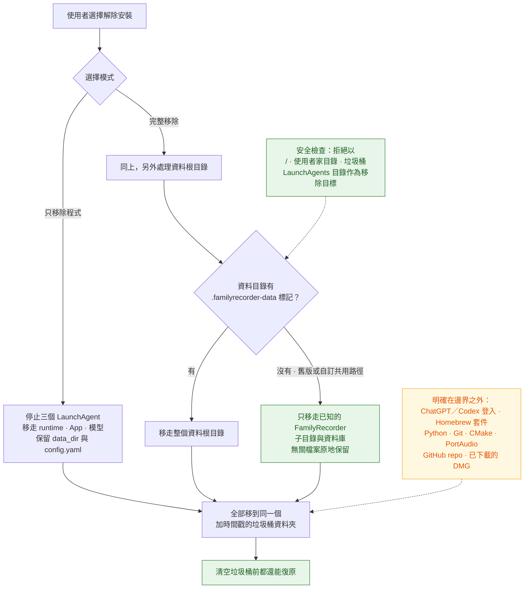

---

## 信任邊界總結

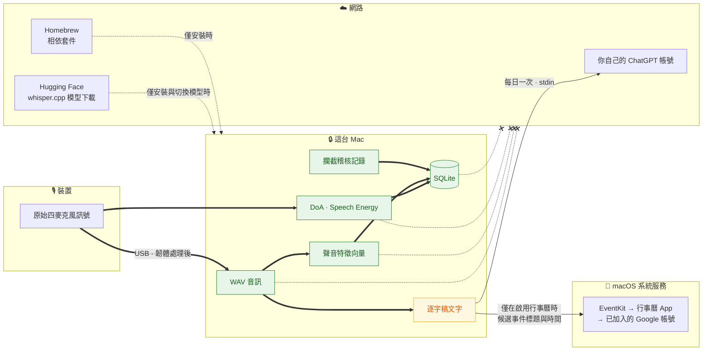

`-.-x` 的四條線代表**從不離開這台 Mac**。唯一跨越邊界的是逐字稿文字，每天一次。完整威脅模型見 [隱私與信任邊界](privacy.md)。

---

## 明確非目標

這些不是「還沒做」，而是**刻意不做**：

- ❌ 鑑識等級的聲紋辨識、身分驗證，或逐字級 diarization
- ❌ 把 DoA 當成身分、距離、房間座標，或「這段話整段都是同一個人說的」的證明
- ❌ 隱蔽錄音
- ❌ 即時雲端轉錄
- ❌ 上傳或遠端備份原始音訊
- ❌ 自動執行推測出來的待辦或提醒
- ❌ 網頁儀表板

---

## 延伸閱讀

- [資料與 SQLite](data-model.md) — 每一張表與欄位的完整定義
- [隱私與信任邊界](privacy.md) — 威脅模型與同意
- [設定參考](configuration.md) — 影響上述每一個決策點的參數
- [應用場景指南](use-cases.md) — 同一套架構怎麼換成別的服務
