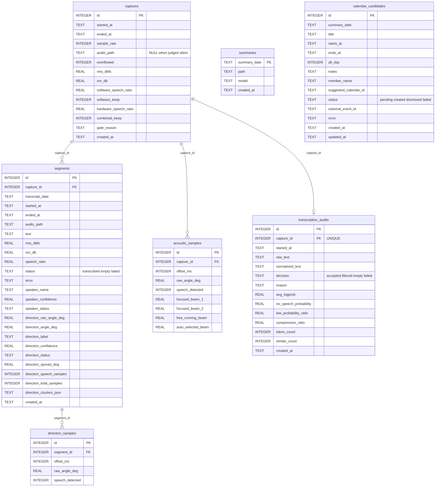

# Data and SQLite

**English** · [繁體中文](data-model.md) · [Back to docs index](README.en.md)

FamilyRecorder splits data into two kinds: **Markdown for humans** and a **queryable, re-analyzable SQLite index**. All of it stays local.

---

## Contents

- [Directory layout](#directory-layout)
- [Database relationships](#database-relationships)
- [captures](#captures) · [segments](#segments) · [transcription_audits](#transcription_audits)
- [acoustic_samples](#acoustic_samples) · [direction_samples](#direction_samples)
- [summaries](#summaries) · [calendar_candidates](#calendar_candidates)
- [Useful queries](#useful-queries)
- [What retention affects](#what-retention-affects)

---

## Directory layout

```text
~/xvf3800-listener-data/
├── .familyrecorder-data                   # ownership marker for safe uninstall
├── audio/YYYY-MM-DD/HHMMSS_microseconds.wav
├── transcripts/YYYY-MM-DD.md
├── summaries/YYYY-MM-DD.md
├── placement-tests/YYYYMMDD-HHMMSS/
├── speaker-profiles/speaker-<hash>.json   # local voice features; no enrollment audio
├── control.json                           # exists only while paused
├── logs/
└── listener.sqlite3
```

| Path | Contents | Ever leaves this Mac? |
|---|---|---|
| `audio/` | 16 kHz mono PCM16 WAVs, foldered by date | ❌ Never |
| `transcripts/` | Daily Markdown transcripts with time / speaker / direction headings | ⚠️ Text goes to the summary once a day |
| `summaries/` | Daily Markdown summaries | ❌ Never (this is output, not input) |
| `placement-tests/` | Placement-test recordings and `report.md` | ❌ Never |
| `speaker-profiles/` | Mode `0600` JSON feature vectors, **not playable** | ❌ Never |
| `control.json` | Pause state and expiry | ❌ Never |
| `logs/` | listener / summary / menubar logs and error logs | ❌ Never |
| `listener.sqlite3` | All indexes and telemetry | ❌ Never |

The `.familyrecorder-data` marker lets the uninstaller confirm this is a FamilyRecorder-owned folder. For an older or custom unmarked shared path, complete removal moves only known children and the database.

---

## Database relationships


`summaries` and `calendar_candidates` relate to that day's transcript and summary by date string, with no foreign-key constraint.

---

## `captures`

**Every completed 30-second chunk lands here**, including those the fused gate judged silent with no WAV. This is the first place to look when asking "why is there no transcript for that moment?"

| Column | Description |
|---|---|
| `audio_path` | `NULL` when judged silent |
| `overflowed` | Whether a buffer overflow occurred during capture |
| `software_speech_ratio` | Fraction of frames WebRTC VAD judged speech |
| `software_keep` | What software VAD alone decided |
| `hardware_speech_ratio` | Non-zero share of auto-selected-beam Speech Energy. `NULL` when unreadable |
| `combined_keep` | The final fused decision |
| `gate_reason` | The final reason — see below |

### Possible `gate_reason` values

| Value | Meaning |
|---|---|
| `software_vad` | ✅ Software VAD passed and no hallucination rule rejected it |
| `xvf3800_speech_energy` | ✅ Software VAD failed, but hardware Speech Energy rescued the chunk |
| `silence` | ❌ Both judged it silent |
| `software_vad; speech_energy_unavailable` | ❌ Software VAD failed and hardware telemetry was unreadable |
| `hallucination_filter:hardware_silence` | ❌ Hardware silence vetoed a low-SNR software VAD pass |
| `hallucination_filter:tonal_noise` | ❌ Low-frequency / narrow-tonal steady noise |
| `hallucination_filter:adaptive_noise_floor` | ❌ Near the adaptive noise floor |

The decision order is in [architecture](architecture.en.md#gate-decision-order).

---

## `segments`

The **Whisper-segment-level** index; one 30-second chunk usually produces several rows. `capture_id` links back to the source capture.

### `status`

| Value | Meaning |
|---|---|
| `transcribed` | Whisper produced text, appended to the day's Markdown |
| `empty` | Whisper succeeded but produced no text; nothing is written to Markdown |
| `failed` | Whisper failed. **The WAV is always kept** until retention expires, for diagnosis |

### Speaker columns

| Column | Description |
|---|---|
| `speaker_name` | The likely speaker's name |
| `speaker_confidence` | **Local feature similarity**, not a statistically calibrated identity probability |
| `speaker_status` | `recognized` / `mixed` / `uncertain` / `disabled` |

### Direction columns

| Column | Description |
|---|---|
| `direction_raw_angle_deg` | The raw angle reported by the XVF3800 |
| `direction_angle_deg` | The angle after rotation by `front_angle_degrees` |
| `direction_label` | front / left / behind / right |
| `direction_confidence` | Sample share of the primary direction |
| `direction_status` | `detected` / `multiple` / `uncertain` / `unavailable` / `disabled` |
| `direction_spread_deg` | Angular spread of the primary cluster |
| `direction_speech_samples` | Speech-flagged direction samples |
| `direction_total_samples` | Total direction samples in the interval |
| `direction_clusters_json` | All clusters as JSON — where a second direction is visible |

---

## `transcription_audits`

**One row per capture** (`capture_id` is UNIQUE), recording the decision made after Whisper returned. This is where to look when asking "why did that sentence not appear in the transcript?"

| Column | Description |
|---|---|
| `raw_text` | **The raw candidate text, including rejected content** |
| `normalized_text` | NFKC-normalized, casefolded, alphanumerics only — used for similarity comparison |
| `decision` | `accepted` / `filtered` / `empty` / `failed` |
| `reason` | Rejection reason, e.g. `whisper_low_logprob`, `repeated_across_chunks` |
| `avg_logprob` | Average token log probability |
| `no_speech_probability` | No-speech probability reported by Whisper |
| `low_probability_ratio` | Share of low-confidence tokens |
| `compression_ratio` | Text compression ratio |
| `token_count` | Token count |
| `similar_count` | How many similar passages already appeared in the window |

> **Rejected text never enters Markdown or the daily cloud summary.** It exists only in this table, for you to inspect.

---

## `acoustic_samples`

A re-analyzable, **low-volume time series**. Each row aligns to one instant by `capture_id + offset_ms`.

Thirty seconds at four samples per second is roughly **120 rows**. If one USB command temporarily fails, that row's corresponding columns are `NULL` while the other successful telemetry is preserved.

**This table is not affected by WAV retention** and is never sent to ChatGPT. Even after retention has removed the WAV, you can still analyze the direction and energy distribution from that moment.

---

## `direction_samples`

Linked to `segments` by `segment_id`, holding per-sample direction data **within one text segment's interval**. The difference from `acoustic_samples`: that table is per capture and covers the whole 30 seconds, while this one covers a single Whisper segment and is retained as a compatibility view.

---

## `summaries`

Keyed by `summary_date`. Re-running a day **updates that row** rather than creating conflicting duplicates.

| Column | Description |
|---|---|
| `summary_date` | The date the summary covers (primary key) |
| `path` | Path to `summaries/YYYY-MM-DD.md` |
| `model` | The Codex model marker actually used |
| `created_at` | **When the summary was generated**, not when events happened |

> Event times inside a Markdown summary **always come from the transcript headings**. `created_at` is only the moment the summary was produced.

---

## `calendar_candidates`

`UNIQUE(summary_date, title, starts_at, member_name)` prevents duplicates when a day is re-run.

| Column | Description |
|---|---|
| `status` | `pending` / `created` / `dismissed` / `failed` |
| `all_day` | `1` when the date is known but the time is not |
| `member_name` | The member suggested by the model; empty when undetermined |
| `suggested_calendar_id` | The calendar suggested by the model |
| `external_event_id` | The EventKit event ID after successful creation |
| `error` | Why creation failed |

State transitions are in [architecture](architecture.en.md#calendar-candidate-state-machine).

---

## Useful queries

```bash
DB="$HOME/xvf3800-listener-data/listener.sqlite3"
```

**The last 10 transcribed segments today:**

```sql
select started_at, speaker_name, direction_label, text
from segments
where transcript_date = date('now','localtime') and status = 'transcribed'
order by id desc limit 10;
```

**Why was that moment not recorded:**

```sql
select started_at, round(rms_dbfs,1) rms, round(snr_db,1) snr,
       round(software_speech_ratio,2) sw, round(hardware_speech_ratio,2) hw,
       gate_reason
from captures order by id desc limit 10;
```

**What the hallucination filter rejected today:**

```sql
select started_at, reason, round(avg_logprob,2) lp, similar_count, raw_text
from transcription_audits
where decision = 'filtered' and date(started_at) = date('now','localtime')
order by id desc;
```

**Rejection reasons by count today:**

```sql
select gate_reason, count(*) from captures
where date(started_at) = date('now','localtime')
group by gate_reason order by 2 desc;
```

**Per-sample direction and energy for one capture:**

```sql
select a.offset_ms, a.raw_angle_deg, a.speech_detected, a.auto_selected_beam
from acoustic_samples a
join captures c on c.id = a.capture_id
order by c.id desc, a.offset_ms limit 120;
```

**Unhandled calendar candidates:**

```sql
select id, summary_date, title, starts_at, all_day, member_name, status
from calendar_candidates where status = 'pending' order by starts_at;
```

**Daily transcription volume:**

```sql
select transcript_date, count(*) segments, sum(length(text)) chars
from segments where status = 'transcribed'
group by transcript_date order by transcript_date desc limit 14;
```

---

## What retention affects

| Data | Affected by `keep_audio_days` |
|---|:---:|
| WAVs under `audio/` | ✅ Yes |
| `transcripts/` Markdown | ❌ No |
| `summaries/` Markdown | ❌ No |
| `segments` / `captures` | ❌ No |
| `transcription_audits` | ❌ No |
| `acoustic_samples` / `direction_samples` | ❌ No |
| `speaker-profiles/` | ❌ No (removed only when a member is deleted) |

WAVs from **failed** transcriptions are always kept until retention expires, even with `delete_audio_after_transcription: true`.

Run it manually:

```bash
family-recorder --config "$CONFIG" cleanup
```

---

## Related documents

- [Architecture](architecture.en.md) — where this data is produced
- [Configuration → storage](configuration.en.md#storage) — retention settings
- [Troubleshooting](troubleshooting.en.md) — using these queries to diagnose problems
