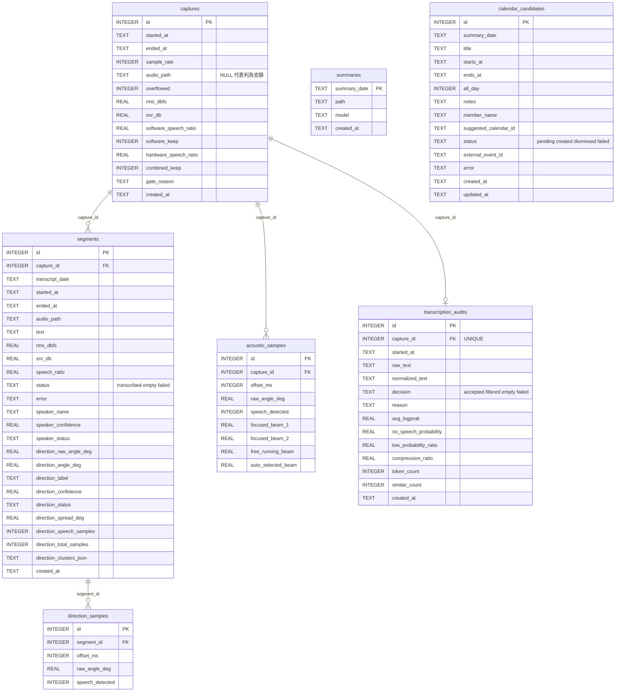

# 資料與 SQLite

[English](data-model.en.md) · **繁體中文** · [返回文件索引](README.md)

FamilyRecorder 把資料分成兩類：**人類閱讀的 Markdown**，以及**可查詢與可重新分析的 SQLite 索引**。所有內容都留在本機。

---

## 目錄

- [資料目錄結構](#資料目錄結構)
- [資料庫關聯總覽](#資料庫關聯總覽)
- [captures](#captures) · [segments](#segments) · [transcription_audits](#transcription_audits)
- [acoustic_samples](#acoustic_samples) · [direction_samples](#direction_samples)
- [summaries](#summaries) · [calendar_candidates](#calendar_candidates)
- [常用查詢](#常用查詢)
- [Retention 影響哪些資料](#retention-影響哪些資料)

---

## 資料目錄結構

```text
~/xvf3800-listener-data/
├── .familyrecorder-data                   # 安全解除安裝用的專用目錄標記
├── audio/YYYY-MM-DD/HHMMSS_microseconds.wav
├── transcripts/YYYY-MM-DD.md
├── summaries/YYYY-MM-DD.md
├── placement-tests/YYYYMMDD-HHMMSS/
├── speaker-profiles/speaker-<雜湊>.json   # 本機聲音特徵；無原始註冊音訊
├── control.json                           # 僅在暫停時存在
├── logs/
└── listener.sqlite3
```

| 路徑 | 內容 | 會離開這台 Mac 嗎 |
|---|---|---|
| `audio/` | 16 kHz mono PCM16 WAV，依日期分資料夾 | ❌ 從不 |
| `transcripts/` | 每日 Markdown 逐字稿，含時間／人別／方向標題 | ⚠️ 文字每日一次送往摘要 |
| `summaries/` | 每日 Markdown 摘要 | ❌ 從不（這是產出，不是輸入） |
| `placement-tests/` | 擺位測試的錄音與 `report.md` | ❌ 從不 |
| `speaker-profiles/` | 權限 `0600` 的 JSON 特徵向量，**不可播放** | ❌ 從不 |
| `control.json` | 暫停狀態與到期時間 | ❌ 從不 |
| `logs/` | listener／summary／menubar 的 log 與 error log | ❌ 從不 |
| `listener.sqlite3` | 全部索引與遙測 | ❌ 從不 |

`.familyrecorder-data` 標記讓解除安裝器確認這是 FamilyRecorder 專用資料夾。沒有標記的舊版或自訂共用路徑，完整移除時只會搬走已知的子目錄與資料庫。

---

## 資料庫關聯總覽



`summaries` 與 `calendar_candidates` 以日期字串關聯到當天的逐字稿與摘要，沒有外鍵約束。

---

## `captures`

**每一個完成擷取的 30 秒 chunk 都會寫進這張表**，包含被融合 gate 判為安靜、沒有建立 WAV 的那些。這是「為什麼這段沒有逐字稿」的第一個查詢對象。

| 欄位 | 說明 |
|---|---|
| `audio_path` | 判為安靜時為 `NULL` |
| `overflowed` | 擷取期間是否發生 buffer overflow |
| `software_speech_ratio` | WebRTC VAD 判為語音的 frame 比例 |
| `software_keep` | software VAD 單獨的判定結果 |
| `hardware_speech_ratio` | auto-selected beam Speech Energy 的非零比例。讀不到時為 `NULL` |
| `combined_keep` | 融合後的最終判定 |
| `gate_reason` | 最終原因，見下表 |

### `gate_reason` 的可能值

| 值 | 意義 |
|---|---|
| `software_vad` | ✅ software VAD 通過，且未被任何防幻覺規則攔下 |
| `xvf3800_speech_energy` | ✅ software VAD 沒過，但硬體 Speech Energy 救回 |
| `silence` | ❌ 兩者都判定安靜 |
| `software_vad; speech_energy_unavailable` | ❌ software VAD 沒過，且硬體遙測讀不到 |
| `hallucination_filter:hardware_silence` | ❌ 硬體靜音否決了低 SNR 的 software VAD |
| `hallucination_filter:tonal_noise` | ❌ 低頻／窄頻固定音 |
| `hallucination_filter:adaptive_noise_floor` | ❌ 接近自適應噪音基線 |

判定順序見 [系統架構](architecture.md#融合閘門的判定順序)。

---

## `segments`

Whisper **段落層級**的索引，一個 30 秒 chunk 通常產生多列。`capture_id` 連回來源 capture。

### `status`

| 值 | 意義 |
|---|---|
| `transcribed` | Whisper 有文字，已附加到當日 Markdown |
| `empty` | Whisper 成功但沒有文字，不寫 Markdown |
| `failed` | Whisper 失敗。**WAV 一律保留**直到 retention 到期，以利排查 |

### 人別欄位

| 欄位 | 說明 |
|---|---|
| `speaker_name` | 可能的說話者姓名 |
| `speaker_confidence` | **本機特徵相似度**，不是統計校準後的身分機率 |
| `speaker_status` | `recognized`／`mixed`／`uncertain`／`disabled` |

### 方向欄位

| 欄位 | 說明 |
|---|---|
| `direction_raw_angle_deg` | XVF3800 回報的原始角度 |
| `direction_angle_deg` | 依 `front_angle_degrees` 校準後的角度 |
| `direction_label` | 正前方／左側／後方／右側 |
| `direction_confidence` | 主要方向的樣本占比 |
| `direction_status` | `detected`／`multiple`／`uncertain`／`unavailable`／`disabled` |
| `direction_spread_deg` | 主要叢集的角度離散程度 |
| `direction_speech_samples` | 帶語音旗標的方向樣本數 |
| `direction_total_samples` | 該區間的方向樣本總數 |
| `direction_clusters_json` | 全部叢集的 JSON，多方向時可看到第二方向 |

---

## `transcription_audits`

**每個 capture 一列**（`capture_id` 為 UNIQUE），記錄 Whisper 回傳後的決策。這是「為什麼這句話沒有出現在逐字稿裡」的查詢對象。

| 欄位 | 說明 |
|---|---|
| `raw_text` | **原始候選文字，包含被攔截的內容** |
| `normalized_text` | NFKC 正規化＋小寫＋只保留英數字，用於相似度比對 |
| `decision` | `accepted`／`filtered`／`empty`／`failed` |
| `reason` | 攔截原因，例如 `whisper_low_logprob`、`repeated_across_chunks` |
| `avg_logprob` | 平均 token log probability |
| `no_speech_probability` | Whisper 回報的無語音機率 |
| `low_probability_ratio` | 低可信 token 比例 |
| `compression_ratio` | 文字壓縮率 |
| `token_count` | token 數 |
| `similar_count` | 視窗內相似句已出現次數 |

> **被攔截的文字永遠不會進入 Markdown 或每日雲端摘要。** 它只留在這張表裡供你檢查。

---

## `acoustic_samples`

可重新分析的**低容量 time series**。每列以 `capture_id + offset_ms` 對齊同一時刻。

30 秒、每 0.25 秒一次約 **120 列**。某一個 USB command 暫時失敗時，該列對應欄位為 `NULL`，其他成功的遙測仍保留。

**這張表不受 WAV retention 影響**，也不會送往 ChatGPT。即使 WAV 已因 retention 刪除，你仍可以回頭分析當時的方向與能量分布。

---

## `direction_samples`

以 `segment_id` 連回 `segments`，保存**該文字片段區間內**的逐筆方向樣本。與 `acoustic_samples` 的差別：前者以 capture 為單位涵蓋整個 30 秒，後者只涵蓋一個 Whisper 段落，是為了相容而保留的視圖。

---

## `summaries`

以 `summary_date` 為主鍵。重新整理同一天會**更新該列**，不會建立多份互相衝突的摘要。

| 欄位 | 說明 |
|---|---|
| `summary_date` | 摘要對應的日期（主鍵） |
| `path` | `summaries/YYYY-MM-DD.md` 的路徑 |
| `model` | 實際使用的 Codex 模型標記 |
| `created_at` | **摘要產生時間**，不是事件發生時間 |

> Markdown 摘要中的事件時間**一律以逐字稿標題為準**。`created_at` 只是這份摘要被產生的時刻。

---

## `calendar_candidates`

`UNIQUE(summary_date, title, starts_at, member_name)` 確保重跑同一天不會重複建立。

| 欄位 | 說明 |
|---|---|
| `status` | `pending`／`created`／`dismissed`／`failed` |
| `all_day` | 日期明確但沒有時間時為 `1` |
| `member_name` | AI 建議的成員；無法判斷時為空字串 |
| `suggested_calendar_id` | AI 建議的日曆 |
| `external_event_id` | 建立成功後的 EventKit 事件 ID |
| `error` | 建立失敗的原因 |

狀態轉換見 [系統架構](architecture.md#行事曆候選事件狀態機)。

---

## 常用查詢

```bash
DB="$HOME/xvf3800-listener-data/listener.sqlite3"
```

**今天最近 10 段逐字稿：**

```sql
select started_at, speaker_name, direction_label, text
from segments
where transcript_date = date('now','localtime') and status = 'transcribed'
order by id desc limit 10;
```

**為什麼剛才那段沒有被錄下來：**

```sql
select started_at, round(rms_dbfs,1) rms, round(snr_db,1) snr,
       round(software_speech_ratio,2) sw, round(hardware_speech_ratio,2) hw,
       gate_reason
from captures order by id desc limit 10;
```

**今天被防幻覺攔掉了什麼：**

```sql
select started_at, reason, round(avg_logprob,2) lp, similar_count, raw_text
from transcription_audits
where decision = 'filtered' and date(started_at) = date('now','localtime')
order by id desc;
```

**今天各種攔截原因的統計：**

```sql
select gate_reason, count(*) from captures
where date(started_at) = date('now','localtime')
group by gate_reason order by 2 desc;
```

**某個片段的逐筆方向與能量：**

```sql
select a.offset_ms, a.raw_angle_deg, a.speech_detected, a.auto_selected_beam
from acoustic_samples a
join captures c on c.id = a.capture_id
order by c.id desc, a.offset_ms limit 120;
```

**還沒處理的行事曆候選：**

```sql
select id, summary_date, title, starts_at, all_day, member_name, status
from calendar_candidates where status = 'pending' order by starts_at;
```

**每天的轉錄量：**

```sql
select transcript_date, count(*) segments, sum(length(text)) chars
from segments where status = 'transcribed'
group by transcript_date order by transcript_date desc limit 14;
```

---

## Retention 影響哪些資料

| 資料 | 受 `keep_audio_days` 影響 |
|---|:---:|
| `audio/` 的 WAV | ✅ 是 |
| `transcripts/` Markdown | ❌ 否 |
| `summaries/` Markdown | ❌ 否 |
| `segments` / `captures` | ❌ 否 |
| `transcription_audits` | ❌ 否 |
| `acoustic_samples` / `direction_samples` | ❌ 否 |
| `speaker-profiles/` | ❌ 否（只在刪除成員時移除） |

轉錄**失敗**的 WAV 一律保留到 retention 到期，即使 `delete_audio_after_transcription: true`。

手動執行：

```bash
family-recorder --config "$CONFIG" cleanup
```

---

## 相關文件

- [系統架構](architecture.md) —— 這些資料在哪裡產生
- [設定參考 → storage](configuration.md#storage) —— retention 設定
- [常見問題](troubleshooting.md) —— 用這些查詢排查問題
