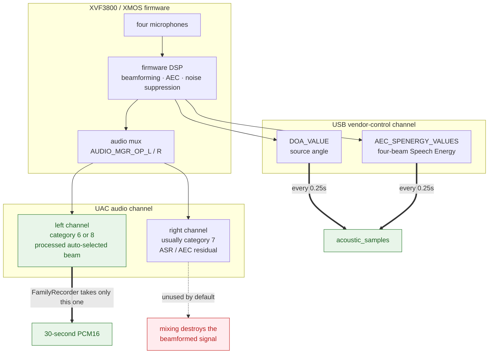

# Hardware and capture

**English** · [繁體中文](hardware.md) · [Back to docs index](README.en.md)

The XVF3800 exposes two independent data channels: **UAC audio** and **USB vendor-control telemetry**. This document covers how to confirm both work, how to calibrate the room's front direction, and how to decide where the microphone belongs by measurement rather than guesswork.

---

## Contents

- [The two channels](#the-two-channels)
- [Beamforming diagnosis](#beamforming-diagnosis)
- [Direction telemetry and four-beam Speech Energy](#direction-telemetry-and-four-beam-speech-energy)
- [Direction calibration](#direction-calibration)
- [Mic placement test](#mic-placement-test)
- [Physical placement advice](#physical-placement-advice)

---

## The two channels



**Key fact:** the direction angle and Speech Energy are **not extra channels inside the WAV**. They are read separately through USB control commands. So "audio records fine" does not imply "direction is readable", and vice versa.

In Seeed's official routing definitions, category `6` is processed beamformed and source `3` is the auto-selected best beam; category `8` source `0/1` currently mirrors that output.

Reference documentation:

- [XVF3800 hardware / UA setup](https://www.xmos.com/documentation/XM-014888-PC/html/modules/fwk_xvf/doc/user_guide/02_setting_up_the_hardware.html)
- [XVF3800 audio pipeline](https://www.xmos.com/documentation/XM-014888-PC/html/modules/fwk_xvf/doc/datasheet/03_audio_pipeline.html)
- [Seeed XVF3800 Host Control](https://github.com/respeaker/reSpeaker_XVF3800_USB_4MIC_ARRAY/blob/master/host_control/README.md)

### Sample rate

XMOS documentation notes that standard UA firmware appears as `XMOS XVF3800 Voice Processor` and that USB Audio can be fixed at either 16 kHz or 48 kHz. FamilyRecorder therefore supports both name matching and sample-rate fallback: if opening at 16 kHz fails, it captures at the device's declared default (usually 48 kHz) and converts locally to the 16 kHz mono PCM16 that Whisper and VAD consume.

---

## Beamforming diagnosis

`diagnose-beamforming` is a **read-only** check. It reads back the actual `AUDIO_MGR_OP_L/R` routing and confirms that FamilyRecorder's mono capture really is the processed auto-selected beam, rather than a raw microphone or the wrong channel. **It never modifies device settings.**

```bash
RUNTIME="$HOME/Library/Application Support/FamilyRecorder"
CONFIG="$HOME/.config/familyrecorder/config.yaml"

"$RUNTIME/venv/bin/family-recorder" --config "$CONFIG" diagnose-beamforming
"$RUNTIME/venv/bin/family-recorder" --config "$CONFIG" diagnose-beamforming --json
```

### Reading the result

| Left-channel routing | Verdict | Meaning |
|---|---|---|
| `(8, 0)` or `(8, 1)` | ✅ Pass | User-chosen, mirroring the processed auto-selected beam |
| `(6, 3)` | ✅ Pass | Processed beamformed, auto-selected best beam |
| `(1, x)` `(2, x)` `(3, x)` `(11, x)` | ❌ Fail | Raw/intermediate microphone — not appropriate for FamilyRecorder |
| `audio.channels: 2` | ⚠️ `ambiguous_stereo_downmix` | Left and right mixed; which processing produced it cannot be verified |

If another tool has changed the routing, restore the processed auto-selected beam per the XVF3800 firmware documentation.

### Why not stereo

Setting `audio.channels` to `2` downmixes left and right into mono. But the right channel usually carries **ASR/AEC residual**, whose processing purpose is entirely different from the left channel's beamformed output. Averaging them destroys the beamformed signal and makes it impossible to verify what was actually captured. The default is therefore `audio.channels: 1`, and with `2` the diagnostic explicitly reports `ambiguous_stereo_downmix` rather than claiming verification.

---

## Direction telemetry and four-beam Speech Energy

During every 30-second capture, FamilyRecorder creates one telemetry row **every 0.25 seconds by default**, on a shared offset:

| Column | Contents |
|---|---|
| `raw_angle_deg` | The raw DoA angle reported by the XVF3800 |
| `speech_detected` | The speech flag at that instant |
| `focused_beam_1` | Speech Energy of focused beam 1 |
| `focused_beam_2` | Speech Energy of focused beam 2 |
| `free_running_beam` | Speech Energy of the free-running beam |
| `auto_selected_beam` | Speech Energy of the auto-selected beam |

Thirty seconds at four samples per second is roughly **120 rows**. If one USB command temporarily fails, that row's corresponding columns are `NULL` while the other successful telemetry is still kept — **one failed command never discards the other command's result**.

### How Speech Energy affects transcription

A non-zero ratio on the auto-selected beam can **rescue** a chunk that WebRTC VAD missed because the speech was quiet, but the chunk must still clear `speech_energy_min_rms_dbfs`, so a single non-zero hardware sample cannot push extremely faint noise into Whisper.

Conversely, when hardware reports clear silence, it **vetoes only when both the software speech ratio and SNR are also weak**, so no single hardware reading is treated as absolute truth. The complete decision order is in [architecture](architecture.en.md#gate-decision-order).

When USB control is temporarily unreadable, the adaptive noise floor takes over and **capture is never interrupted**.

### Circular clustering

Nearby angles are clustered **circularly**, so `358°` and `2°` count as the same direction (an angular distance of 4°, not 356°). If a second, clearly separated direction reaches the `multiple_direction_min_ratio` share, the segment is labeled as multiple directions.

### Quick test

```bash
"$RUNTIME/venv/bin/family-recorder" --config "$CONFIG" probe-direction --seconds 2
```

You can also use the menu bar → "聲音方向" (Sound direction) → "測試目前方向…" (Test current direction), which reports bearing, angle, stability, and valid sample count **without writing to the transcript**.

---

## Direction calibration

The factory `0°` is the microphone's own mechanical orientation, not your room's front. Calibrate on first use:

1. Menu bar → **聲音方向** (Sound direction) → **把目前位置校準為正前方…** (Calibrate this position as the front).
2. Stand where you want "front" to be and have **exactly one person** speak naturally for 4 seconds.
3. Afterwards, transcript angles are relative to that front.

Or from the command line:

```bash
"$RUNTIME/venv/bin/family-recorder" --config "$CONFIG" calibrate-direction --seconds 4
```

### Angle labels after calibration

| Angle | Label |
|---:|---|
| `0°` | Front |
| `90°` | Left |
| `180°` | Behind |
| `270°` | Right |

> **Recalibrate after moving or rotating the microphone.** Raising it without rotating usually does not require recalibration.

The calibration value is stored in `direction.front_angle_degrees`.

---

## Mic placement test

Rather than guessing where the microphone belongs, measure. `placement-test` reads the **identical** set of 20 fixed sentences at several positions and compares RMS, SNR, speech ratio, Whisper output, and **CER (character error rate)**.

Start by comparing three positions — for example "center of the coffee table, raised 10 cm", "on the shelf", and "next to the Mac":

```bash
"$RUNTIME/venv/bin/family-recorder" --config "$CONFIG" \
  placement-test --positions "coffee-table" "shelf" "next-to-mac"
```

Each sentence is recorded for 8 seconds by default. You can change the duration or supply your own sentence file (UTF-8, one sentence per line):

```bash
"$RUNTIME/venv/bin/family-recorder" --config "$CONFIG" \
  placement-test --positions A B C --seconds 10 --sentences-file ./my-sentences.txt
```

### Output

```text
~/xvf3800-listener-data/placement-tests/YYYYMMDD-HHMMSS/
├── 01-A/01.wav ...
├── 02-B/01.wav ...
├── 03-C/01.wav ...
└── report.md
```

`report.md` contains the transcription, RMS, SNR, speech ratio, and CER for every sentence, plus a per-position summary table.

### How to choose

**Prioritize the lowest CER**, then prefer higher SNR, a stable speech ratio, and an RMS that does not clip.

> If SNR shows `n/a`, the whole sentence was usually judged either all speech or all background, leaving no noise frames to compare against. Leave about a second of room tone after pressing Enter before you start reading.

---

## Physical placement advice

| Aspect | Recommendation |
|---|---|
| Orientation | Flat and level, not tilted |
| Position | Near the geometric center of the conversation area |
| Height | About 5–15 cm above the surface |
| Support | 3–6 mm silicone feet or a stable small stand |
| Avoid | Direct contact with the desk (knock vibration), fan airflow, directly in front of speakers, corner reflections |

Raising it a little matters: sitting flat on a desk couples knocks, keyboard strikes, and cups being set down straight into the microphone — exactly the noise most likely to trip the gate while containing no speech at all.

---

## Related documents

- [Architecture → capture path](architecture.en.md#capture-path-the-life-of-a-30-second-chunk) — the complete gate decision order
- [Configuration → direction](configuration.en.md#direction) — every direction-related parameter
- [Speakers and direction](speakers.en.md) — how direction sits alongside timbre
- [Troubleshooting → direction is unreadable](troubleshooting.en.md#direction-shows-as-unreadable)
