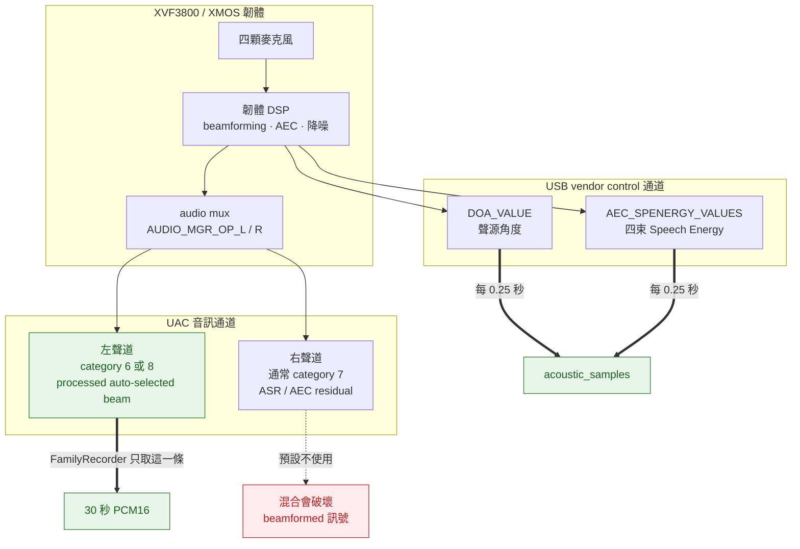

# 硬體與收音

[English](hardware.en.md) · **繁體中文** · [返回文件索引](README.md)

XVF3800 提供兩條互相獨立的資料通道：**UAC 音訊**與 **USB vendor control 遙測**。這份文件說明怎麼確認兩者都正常、怎麼校準房間方向，以及怎麼用實測決定麥克風該放哪裡。

---

## 目錄

- [XVF3800 的兩條通道](#xvf3800-的兩條通道)
- [Beamforming 診斷](#beamforming-診斷)
- [方向遙測與四束 Speech Energy](#方向遙測與四束-speech-energy)
- [方向校準](#方向校準)
- [Mic placement test](#mic-placement-test)
- [實體放置建議](#實體放置建議)

---

## XVF3800 的兩條通道



**關鍵事實：** 方向角與 Speech Energy **不是 WAV 內的額外聲道**，而是另外讀取 USB control command 得到的。所以「音訊錄得到」不代表「方向讀得到」，反之亦然。

Seeed 官方 routing 定義中，category `6` 是 processed beamformed、source `3` 是 auto-selected best beam；category `8` 的 source `0/1` 目前複製這個輸出。

參考文件：

- [XVF3800 硬體／UA 設定](https://www.xmos.com/documentation/XM-014888-PC/html/modules/fwk_xvf/doc/user_guide/02_setting_up_the_hardware.html)
- [XVF3800 音訊處理管線](https://www.xmos.com/documentation/XM-014888-PC/html/modules/fwk_xvf/doc/datasheet/03_audio_pipeline.html)
- [Seeed XVF3800 Host Control](https://github.com/respeaker/reSpeaker_XVF3800_USB_4MIC_ARRAY/blob/master/host_control/README.md)

### 取樣率

XMOS 官方文件指出，標準 UA 韌體會以 `XMOS XVF3800 Voice Processor` 顯示，USB Audio 可固定為 16 kHz 或 48 kHz。FamilyRecorder 因此同時支援名稱比對與取樣率 fallback：若以 16 kHz 開啟失敗，會改用裝置宣告的預設值（通常 48 kHz）擷取，再於本機轉成 Whisper／VAD 使用的 16 kHz 單聲道 PCM16。

---

## Beamforming 診斷

`diagnose-beamforming` 是**唯讀**診斷：它讀回實際的 `AUDIO_MGR_OP_L/R` routing，確認 FamilyRecorder 的單聲道 capture 真的是 processed auto-selected beam，而不是 raw microphone 或混合錯誤的聲道。**它不會修改裝置設定。**

```bash
RUNTIME="$HOME/Library/Application Support/FamilyRecorder"
CONFIG="$HOME/.config/familyrecorder/config.yaml"

"$RUNTIME/venv/bin/family-recorder" --config "$CONFIG" diagnose-beamforming
"$RUNTIME/venv/bin/family-recorder" --config "$CONFIG" diagnose-beamforming --json
```

### 怎麼判讀結果

| 左聲道 routing | 判定 | 意義 |
|---|---|---|
| `(8, 0)` 或 `(8, 1)` | ✅ 通過 | user-chosen，複製 processed auto-selected beam |
| `(6, 3)` | ✅ 通過 | processed beamformed，auto-selected best beam |
| `(1, x)` `(2, x)` `(3, x)` `(11, x)` | ❌ 不通過 | raw／intermediate microphone，不應用於 FamilyRecorder |
| `audio.channels: 2` | ⚠️ `ambiguous_stereo_downmix` | 左右混合，無法驗證是哪一種處理結果 |

若 routing 被其他工具改動過，請依 XVF3800 韌體文件恢復 processed auto-selected beam。

### 為什麼不用立體聲

`audio.channels` 若設為 `2`，會把左右聲道 downmix 成單聲道。但右聲道通常承載 **ASR/AEC residual** —— 它的處理目的與左聲道的 beamformed 輸出完全不同。平均混合兩者會破壞 beamformed 訊號，也讓診斷無法確認實際捕捉到什麼。因此預設是 `audio.channels: 1`，診斷器在 `2` 的情況下會明確標示 `ambiguous_stereo_downmix`，不宣稱已驗證。

---

## 方向遙測與四束 Speech Energy

FamilyRecorder 在每個 30 秒錄音期間，**預設每 0.25 秒**建立一列共同 offset 的遙測，包含：

| 欄位 | 內容 |
|---|---|
| `raw_angle_deg` | XVF3800 回報的原始 DoA 角度 |
| `speech_detected` | 該時刻的語音旗標 |
| `focused_beam_1` | focused beam 1 的 Speech Energy |
| `focused_beam_2` | focused beam 2 的 Speech Energy |
| `free_running_beam` | free-running beam 的 Speech Energy |
| `auto_selected_beam` | auto-selected beam 的 Speech Energy |

30 秒、每 0.25 秒一次約 **120 列**。某一個 USB command 暫時失敗時，該列對應欄位為 `NULL`，其他成功的遙測仍會保留 —— **一個指令失敗不會丟掉另一個指令的結果**。

### Speech Energy 怎麼影響是否轉錄

auto-selected beam 的**非零比例**可以在 WebRTC VAD 漏掉較輕聲語音時保留 chunk，但仍必須通過 `speech_energy_min_rms_dbfs`，避免極低音量雜訊只因單一硬體非零值就進入 Whisper。

反過來，硬體明確靜音時，**只有在 software VAD 比例與 SNR 同時偏低才會否決**，避免把單一硬體讀值當成絕對真相。完整的判定順序見 [系統架構](architecture.md#融合閘門的判定順序)。

USB control 暫時讀不到時，自適應噪音基線會接手，**錄音不會中斷**。

### 環狀分群

相近角度會做**環狀**分群，因此 `358°` 與 `2°` 會視為同一個方向（角距離只有 4°，而不是 356°）。若第二個相隔明顯的方向達到 `multiple_direction_min_ratio` 的比例，該片段會標成「方向：多個」。

### 快速測試

```bash
"$RUNTIME/venv/bin/family-recorder" --config "$CONFIG" probe-direction --seconds 2
```

也可以從選單列 →「聲音方向」→「測試目前方向…」，會在**不寫入逐字稿**的情況下顯示方位、角度、穩定度與有效樣本數。

---

## 方向校準

出廠的 `0°` 是麥克風本身的機構方向，不是你房間的正前方。第一次使用建議校準：

1. 點選單列 FamilyRecorder →「**聲音方向**」→「**把目前位置校準為正前方…**」。
2. 站在你想定義為正前方的位置，**只讓一個人**持續自然說話 4 秒。
3. 完成後，逐字稿顯示的角度就是相對於這個正前方。

或使用指令：

```bash
"$RUNTIME/venv/bin/family-recorder" --config "$CONFIG" calibrate-direction --seconds 4
```

### 校準後的角度對應

| 角度 | 標籤 |
|---:|---|
| `0°` | 正前方 |
| `90°` | 左側 |
| `180°` | 後方 |
| `270°` | 右側 |

> **移動或旋轉麥克風後必須重新校準。** 只把它墊高而沒有旋轉，通常不需要。

校準值存在 `direction.front_angle_degrees`。

---

## Mic placement test

與其猜測麥克風該放哪裡，不如實測。`placement-test` 會在多個位置朗讀**完全相同**的一組 20 句固定句，然後比較 RMS、SNR、speech ratio、Whisper 文字與 **CER（字元錯誤率）**。

建議先比三個位置，例如「茶几中央墊高 10 cm」、「櫃上」、「Mac 旁」：

```bash
"$RUNTIME/venv/bin/family-recorder" --config "$CONFIG" \
  placement-test --positions "茶几中央" "櫃子上" "Mac旁"
```

預設每句錄 8 秒。可自訂秒數或固定句檔（UTF-8，每行一句）：

```bash
"$RUNTIME/venv/bin/family-recorder" --config "$CONFIG" \
  placement-test --positions A B C --seconds 10 --sentences-file ./my-sentences.txt
```

### 輸出

```text
~/xvf3800-listener-data/placement-tests/YYYYMMDD-HHMMSS/
├── 01-A/01.wav ...
├── 02-B/01.wav ...
├── 03-C/01.wav ...
└── report.md
```

`report.md` 包含每一句的轉錄結果、RMS、SNR、speech ratio、CER，以及各位置的彙總表。

### 怎麼選

**以「較低 CER」為主**，再看較高 SNR、穩定的 speech ratio，以及不爆音的 RMS。

> 若 SNR 顯示 `n/a`，通常是整句全部被 VAD 判成語音、或全部判成背景，缺少可比較的噪音 frame。請在按下 Enter 後**留約一秒環境聲再朗讀**。

---

## 實體放置建議

| 項目 | 建議 |
|---|---|
| 方位 | 水平擺放，不要傾斜 |
| 位置 | 接近談話區的幾何中心 |
| 高度 | 離桌面約 5–15 cm |
| 支撐 | 底部用 3–6 mm 矽膠腳墊或穩固小支架 |
| 避免 | 直接接觸桌面（敲桌震動）、風扇氣流、喇叭正前方、牆角反射 |

抬高一點很有幫助：直接貼在桌面上會讓敲擊、鍵盤與杯子放下的震動直接傳進麥克風，而這些正是最容易觸發閘門又完全沒有語音內容的雜訊。

---

## 相關文件

- [系統架構 → 收音路徑](architecture.md#收音路徑30-秒-chunk-的一生) —— 閘門完整判定順序
- [設定參考 → direction](configuration.md#direction) —— 每一個方向相關參數
- [家庭成員與方向](speakers.md) —— 方向如何與音色並列
- [常見問題 → 方向顯示無法讀取](troubleshooting.md#方向顯示無法讀取)
