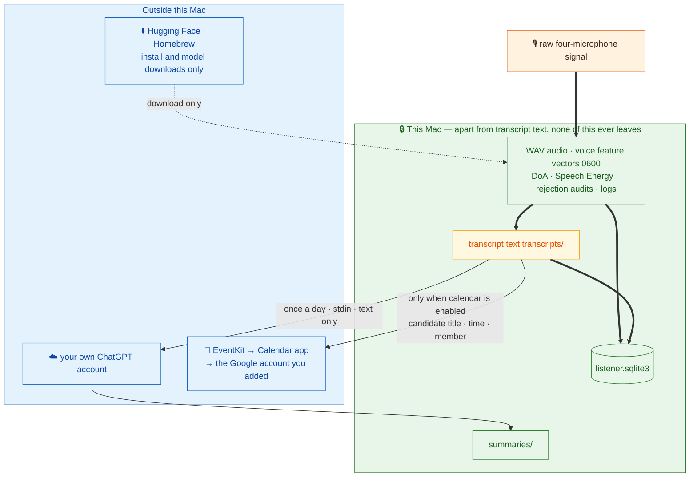

# Privacy and trust boundaries

**English** · [繁體中文](privacy.md) · [Back to docs index](README.en.md)

Whether a computer with an always-on microphone deserves trust depends on whether "what data goes where" can be **verified**, not promised. This document gives the complete answer.

---

## Contents

- [The one-sentence summary](#the-one-sentence-summary)
- [Complete data flow](#complete-data-flow)
- [Where each kind of data goes](#where-each-kind-of-data-goes)
- [Why "text only" is testable](#why-text-only-is-testable)
- [Credentials and keys](#credentials-and-keys)
- [Threat model](#threat-model)
- [Explicit non-goals](#explicit-non-goals)
- [Consent and compliance](#consent-and-compliance)
- [How to verify it yourself](#how-to-verify-it-yourself)

---

## The one-sentence summary

**Raw audio, voice features, USB telemetry, and the SQLite database never leave this Mac. Once a day, only the text of one transcript is sent through the official Codex CLI to your own ChatGPT account.**

If even that is too much, set `summary.enabled: false`. Recording, local transcription, speaker labels, direction, and transcripts are completely unaffected — the whole system becomes 100% offline.

---

## Complete data flow



Everything in green **never leaves this Mac**; only the transcript text, in amber, crosses the boundary once a day.

---

## Where each kind of data goes

| Data | Stored where | Sent to the cloud? | Retention |
|---|---|:---:|---|
| Raw WAV audio | `audio/YYYY-MM-DD/` | ❌ Never | `keep_audio_days`, 7 days by default |
| Voice feature vectors | `speaker-profiles/` (`0600`) | ❌ Never | Until the member or sample is deleted |
| DoA angles and Speech Energy | `acoustic_samples` table | ❌ Never | Indefinite (low volume) |
| Rejected candidate text | `transcription_audits` table | ❌ Never | Indefinite |
| Whisper segment index | `segments` table | ❌ Never | Indefinite |
| Chunk gate telemetry | `captures` table | ❌ Never | Indefinite |
| Log files | `logs/` | ❌ Never | Until manually cleared |
| Daily summaries | `summaries/` | ❌ Never (this is output) | Indefinite |
| Placement-test recordings | `placement-tests/` | ❌ Never | Until manually cleared |
| Pause state | `control.json` | ❌ Never | Exists only while paused |
| **Transcript text** | `transcripts/` | ⚠️ **Once a day** | Indefinite |
| Calendar candidate titles and times | `calendar_candidates` table | ⚠️ Only when calendar is enabled | Indefinite |

### What "silent" means

For a 30-second chunk the fused gate judges silent:

- ❌ **No WAV is created**
- ❌ **Whisper is never invoked**
- ✅ Rows are still written to `captures` and `acoustic_samples` — numeric telemetry only, no audio and no text

So a completely quiet night leaves a few thousand rows of numbers on disk, and no audio or text at all.

### Rejected text

Candidate text rejected by the hallucination filter is written **only to `transcription_audits`**. It never enters the Markdown transcript, and therefore **never enters the input to the cloud summary**.

---

## Why "text only" is testable

This is not a prompt constraint — it is a **structural property of the code**:

| Protection | Mechanism | How to verify |
|---|---|---|
| No audio read | The `summary` code path contains **no audio decoding or upload implementation** | Read `src/family_recorder/summary.py`; it imports only `config` and `storage` |
| One file opened | `DailySummaryRunner` opens only `transcripts/YYYY-MM-DD.md` | Watch a summary run with `fs_usage` or `opensnoop` |
| Not in the process list | The transcript reaches Codex over **stdin** | `ps aux \| grep codex` during a run |
| No credential file read | Only the official `codex login status` is executed | Same as above |
| Read-only sandbox | Every invocation uses `--ephemeral`, `--sandbox read-only`, and an empty temporary working directory | Read the argv assembly in `summary.py` |
| Injection-resistant | The prompt states transcript content is **untrusted** and forbids tool use | Read the fixed contracts in `summary.py` |
| No local rules loaded | User MCP settings and project rules are ignored | Same as above |

CI includes isolated tests over the text-only summary path; [the development guide](development.en.md) explains how to run them locally.

---

## Credentials and keys

| Item | Status |
|---|---|
| OpenAI API key | ❌ **Not required, not accepted, not read** |
| ChatGPT sign-in | Stored and refreshed by the official Codex CLI itself |
| Codex token file | ❌ FamilyRecorder **never opens it** |
| Browser cookies / OAuth tokens | ❌ **Never read or copied** |
| Google password / OAuth token | ❌ **Not stored.** Writes go through the account already in macOS Internet Accounts |
| launchd environment variables | Only `HOME`, so the official CLI can find its own login. **No keys or tokens** |
| YAML / plist / logs | ❌ **Contain no credentials** |

Item 9 of the acceptance checklist verifies exactly this: `codex login status` and `doctor` both report signed in, while YAML, plists, environment variables, and Python dependencies contain no OpenAI API key.

---

## Threat model

### What this design protects against

| Threat | Protection |
|---|---|
| A cloud service obtaining raw household recordings | Audio is never uploaded; the summary path has no upload implementation |
| A cloud service obtaining voiceprints | Feature vectors are never uploaded and cannot be reconstructed into audio |
| Hallucinated text being taken as real conversation | Multi-layer statistical filtering plus a complete audit trail |
| The summary model rewriting event times | The time contract is appended in code, and source times come from transcript headings |
| Instructions embedded in a transcript steering the summary | The prompt marks transcript content untrusted, forbids tool use, and runs in a read-only sandbox |
| Data accumulating during silence | The fused gate rejects before anything is written |
| Residue after uninstall | Files move to the Trash rather than being deleted, and an ownership marker prevents removing the wrong directory |
| Root privilege spread | All three jobs are **per-user LaunchAgents**, not root daemons |

### What this design does **not** protect against

| Threat | Why |
|---|---|
| **Anyone with physical or remote access to this Mac** | Transcripts, audio, and features are stored in the clear locally. **Protect the account password and enable FileVault** |
| **Backup exposure** | Time Machine and iCloud backups include the data directory. Mind their encryption and access |
| **Transcript content once cloud summaries are on** | Once text reaches your ChatGPT account, that account's data policy applies. **Review your ChatGPT data settings first** |
| **One resident reading another's transcripts** | This is shared data on a shared computer. **That is a household trust question, not a technical one** |
| **Recording without consent** | Nothing technically prevents you from recording someone who does not know. **That responsibility is yours** |
| **Misunderstandings from recognition errors** | Speaker labels are approximate and text can be wrong. **Never use this as evidence in a dispute** |

---

## Explicit non-goals

These are not "not yet built" — they are **deliberately excluded**:

- ❌ Biometric-grade speaker identification, authentication, or word-level diarization
- ❌ Treating DoA as identity, distance, room coordinates, or proof that one person spoke an entire segment
- ❌ **Covert recording** — this project provides no way to hide that recording is happening
- ❌ Live cloud transcription
- ❌ Uploading or remotely backing up raw audio
- ❌ Acting on inferred tasks or reminders
- ❌ A web dashboard

### Explicitly prohibited uses

**Do not** use FamilyRecorder for:

- Access control, payments, or any identity verification
- Parental surveillance, checking up on a partner, employee attendance
- Gathering "evidence" for a dispute or lawsuit
- Recording people who do not know or have not agreed

Speaker labels are **approximations**, direction is an **angle rather than a name**, and Whisper text **can be wrong**. Treating them as established fact hurts real people.

---

## Consent and compliance

Confirm every line before installing:

- [ ] **Everyone who might be recorded knows, and agrees.** Not only residents — visitors, tutors, and repair technicians count too.
- [ ] **The recording is visible.** The device sits in plain sight, with a written notice where appropriate.
- [ ] **There is an obvious way to turn it off, and everyone knows how.** Teach the whole household the menu-bar pause.
- [ ] **Local law permits it.** Rules on recording consent (one-party vs. all-party) vary widely.
- [ ] **Minors are covered by guardian consent, and know about it themselves.**
- [ ] **Everyone re-confirms before cloud summaries are enabled.**
- [ ] **It will not be used to monitor anyone.**

Bedrooms, bathrooms, guest rooms, and tutoring or visitor situations carry a higher consent bar. Related discussion in the [use-case guide](use-cases.en.md#the-ethics-checklist-every-scenario-shares).

> This document is not legal advice. Recording law varies by jurisdiction and changes over time.

---

## How to verify it yourself

Do not just trust the documentation. Run these checks:

**1. Confirm no audio is read during a summary run:**

```bash
# Run a summary in another terminal and watch which files are opened
sudo fs_usage -w -f filesys | grep -i familyrecorder
```

**2. Confirm the transcript is not in process arguments:**

```bash
# During a summary run
ps auxww | grep codex
```

**3. Confirm no keys in the config or plists:**

```bash
grep -ri "api[_-]\?key\|sk-" ~/.config/familyrecorder/ ~/Library/LaunchAgents/com.familyrecorder.* 2>/dev/null
```

**4. Confirm silence produces no WAV:**

```bash
# After five quiet minutes
sqlite3 "$HOME/xvf3800-listener-data/listener.sqlite3" \
  "select gate_reason, count(*), sum(audio_path is null) as no_wav
   from captures where started_at > datetime('now','-5 minutes') group by gate_reason;"
```

**5. Read the code.** `summary.py` is 515 lines — short enough to read end to end. What it imports and which files it opens are plain to see.

The full 31-item hardware acceptance checklist is in [development and testing](development.en.md#acceptance-checklist).

---

## Related documents

- [Architecture → trust boundary summary](architecture.en.md#trust-boundary-summary)
- [Daily summary → the text-only boundary](daily-summary.en.md#the-text-only-boundary)
- [Speakers and direction → privacy](speakers.en.md#privacy)
- [Data and SQLite](data-model.en.md) — where each kind of data lives
- [Menu bar and services → one-click uninstall](menu-bar.en.md#one-click-uninstall)
- [Security policy](../SECURITY.en.md) — how to report a security problem
