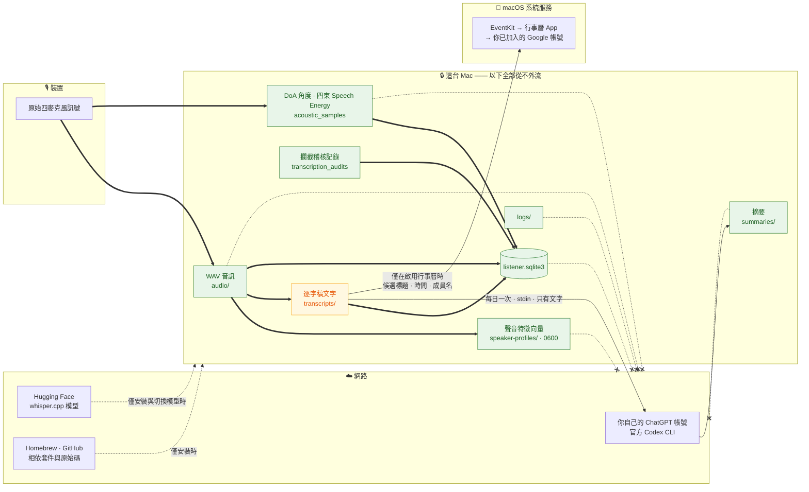

# 隱私與信任邊界

[English](privacy.en.md) · **繁體中文** · [返回文件索引](README.md)

一台永遠開著麥克風的電腦，值不值得信任，取決於「什麼資料去了哪裡」能不能被**驗證**，而不是被承諾。這份文件寫出完整答案。

---

## 目錄

- [一句話總結](#一句話總結)
- [資料流全圖](#資料流全圖)
- [每一種資料去了哪裡](#每一種資料去了哪裡)
- [為什麼「只有文字」是可測試的](#為什麼只有文字是可測試的)
- [認證與金鑰](#認證與金鑰)
- [威脅模型](#威脅模型)
- [明確非目標](#明確非目標)
- [同意與法遵](#同意與法遵)
- [如何自己驗證](#如何自己驗證)

---

## 一句話總結

**原始音訊、聲音特徵、USB 遙測與 SQLite 永遠不會離開這台 Mac。每天一次，只有一份逐字稿的文字，透過官方 Codex CLI 送到你自己的 ChatGPT 帳號。**

如果連這一次都不想要，把 `summary.enabled` 設為 `false`。錄音、本機轉錄、人別、方向與逐字稿完全不受影響 —— 整個系統變成 100% 離線。

---

## 資料流全圖



`-.-x` 的線代表**從不離開這台 Mac**。

---

## 每一種資料去了哪裡

| 資料 | 存在哪裡 | 送往雲端？ | 保留多久 |
|---|---|:---:|---|
| 原始 WAV 音訊 | `audio/YYYY-MM-DD/` | ❌ 從不 | `keep_audio_days`，預設 7 天 |
| 聲音特徵向量 | `speaker-profiles/`（`0600`） | ❌ 從不 | 直到刪除成員或樣本 |
| DoA 角度與 Speech Energy | `acoustic_samples` 表 | ❌ 從不 | 無限期（低容量） |
| 攔截的候選文字 | `transcription_audits` 表 | ❌ 從不 | 無限期 |
| Whisper 段落索引 | `segments` 表 | ❌ 從不 | 無限期 |
| chunk 閘門遙測 | `captures` 表 | ❌ 從不 | 無限期 |
| Log 檔 | `logs/` | ❌ 從不 | 直到手動清除 |
| 每日摘要 | `summaries/` | ❌ 從不（這是產出） | 無限期 |
| 擺位測試錄音 | `placement-tests/` | ❌ 從不 | 直到手動清除 |
| 暫停狀態 | `control.json` | ❌ 從不 | 僅在暫停時存在 |
| **逐字稿文字** | `transcripts/` | ⚠️ **每日一次** | 無限期 |
| 行事曆候選標題與時間 | `calendar_candidates` 表 | ⚠️ 僅在啟用行事曆時 | 無限期 |

### 「安靜」意味著什麼

融合閘門判定為安靜的 30 秒 chunk：

- ❌ **不建立 WAV**
- ❌ **不呼叫 Whisper**
- ✅ 仍寫入 `captures` 與 `acoustic_samples`（低容量數值遙測，沒有音訊、沒有文字）

所以「安靜的一整晚」在磁碟上只留下幾千列數字，沒有任何聲音或文字。

### 被攔截的文字

防幻覺過濾攔下的候選文字**只寫入 `transcription_audits`**，永遠不會進入 Markdown 逐字稿，因此也**永遠不會進入雲端摘要的輸入**。

---

## 為什麼「只有文字」是可測試的

這不是靠 prompt 約束，而是**程式結構上的限制**：

| 保護 | 做法 | 怎麼驗證 |
|---|---|---|
| 不讀音訊 | `summary` 指令的程式路徑**沒有任何音訊解碼或上傳實作** | 讀 `src/family_recorder/summary.py`；它只 import `config` 與 `storage` |
| 只開一個檔 | `DailySummaryRunner` 只開啟 `transcripts/YYYY-MM-DD.md` | 用 `fs_usage` 或 `opensnoop` 觀察摘要執行 |
| 不進 process 清單 | 逐字稿透過 **stdin** 傳給 Codex | 摘要執行時 `ps aux \| grep codex` |
| 不讀認證檔 | 只執行官方 `codex login status` | 同上 |
| 唯讀沙箱 | 每次呼叫都是 `--ephemeral`、`--sandbox read-only`、空白暫存工作目錄 | 讀 `summary.py` 的 argv 組裝 |
| 不受注入 | prompt 明確要求把逐字稿視為**不可信輸入**、不得使用工具 | 讀 `summary.py` 的固定契約 |
| 不載入本機規則 | 忽略使用者 MCP 設定與專案規則 | 同上 |

CI 中有隔離測試覆蓋純文字摘要路徑；[開發文件](development.md) 說明怎麼在本機跑。

---

## 認證與金鑰

| 項目 | 狀態 |
|---|---|
| OpenAI API key | ❌ **不需要、不接受、不讀取** |
| ChatGPT 登入 | 由官方 Codex CLI 自己保存與更新 |
| Codex token 檔 | ❌ FamilyRecorder **從不開啟** |
| 瀏覽器 cookie／OAuth token | ❌ **從不讀取或複製** |
| Google 密碼／OAuth token | ❌ **不另存**。透過 macOS「Internet 帳號」的既有帳號寫入 |
| launchd 環境變數 | 只提供 `HOME`，讓官方 CLI 找到它自己的登入。**沒有任何 key 或 token** |
| YAML／plist／log | ❌ **不包含任何憑證** |

驗收清單第 9 項就是驗證這件事：`codex login status` 與 `doctor` 都顯示已登入，同時 YAML、plist、環境變數與 Python dependencies 均沒有 OpenAI API key。

---

## 威脅模型

### 這套設計防護的

| 威脅 | 防護 |
|---|---|
| 雲端服務取得家中原始錄音 | 音訊從不上傳；摘要路徑沒有上傳實作 |
| 雲端服務取得聲紋 | 特徵向量從不上傳，且無法還原成聲音 |
| 幻覺文字被當成真實對話 | 多層統計過濾＋完整稽核記錄 |
| 摘要模型竄改事件時間 | 時間契約由程式強制附加，來源時間來自逐字稿標題 |
| 逐字稿內容注入指令操縱摘要 | prompt 明確要求視為不可信輸入、禁止工具使用、唯讀沙箱 |
| 安靜時仍持續累積資料 | 融合閘門在寫檔前就否決 |
| 解除安裝後殘留 | 移到垃圾桶而非直接刪除，可復原；有專用目錄標記防止誤刪 |
| root 權限擴散 | 三個工作都是**使用者層級 LaunchAgent**，不是 root daemon |

### 這套設計**不**防護的

| 威脅 | 為什麼 |
|---|---|
| **能實體或遠端存取這台 Mac 的人** | 逐字稿、音訊、特徵都在本機明文。**保護好 Mac 帳號密碼與 FileVault** |
| **備份外洩** | Time Machine、iCloud 備份會包含資料目錄。留意備份的加密與存取權 |
| **啟用雲端摘要後的逐字稿內容** | 文字送到你的 ChatGPT 帳號後，適用該帳號的資料政策。**先看過 ChatGPT 的資料設定** |
| **同住者取得對方的逐字稿** | 這是一台共用電腦上的共用資料。**這是家庭內部的信任問題，不是技術問題** |
| **未取得同意的錄音** | 技術上無法阻止你錄下不知情的人。**這是你的責任** |
| **模型辨識錯誤造成的誤解** | 人別是近似結果、文字可能有錯。**不可作為爭議或法律證據** |

---

## 明確非目標

這些不是「還沒做」，而是**刻意不做**：

- ❌ 鑑識等級的聲紋辨識、身分驗證，或逐字級 diarization
- ❌ 把 DoA 當成身分、距離、房間座標，或「這段話整段都是同一個人說的」的證明
- ❌ **隱蔽錄音** —— 本專案不提供任何隱藏收音狀態的功能
- ❌ 即時雲端轉錄
- ❌ 上傳或遠端備份原始音訊
- ❌ 自動執行推測出來的待辦或提醒
- ❌ 網頁儀表板

### 明確禁止的用途

**不要**把 FamilyRecorder 用於：

- 門禁、付款或任何身分驗證
- 家長監控、伴侶查勤、員工考勤
- 蒐集爭議或訴訟的「證據」
- 錄下不知情或未同意的人

音色人別是**近似結果**，方向是**角度而不是姓名**，Whisper 文字**可能有錯**。把它們當成確定事實，會傷害到真實的人。

---

## 同意與法遵

安裝前逐項確認：

- [ ] **所有可能被錄到的人都知道，而且同意。** 不只是同住者 —— 訪客、家教老師、維修人員也算。
- [ ] **收音是可見的。** 裝置放在看得到的地方，必要時加上文字標示。
- [ ] **有明確的關閉方式，而且大家都知道怎麼用。** 教會家裡每個人選單列的暫停功能。
- [ ] **當地法律允許。** 各地對錄音同意（單方同意 vs. 全體同意）的規定差異很大。
- [ ] **未成年人由監護人同意，而且本人也知情。**
- [ ] **啟用雲端摘要前，全體再確認一次。**
- [ ] **不會用來監控任何人。**

臥室、浴室、客房與家教／訪客場合的同意門檻更高。相關討論見 [應用場景指南](use-cases.md#每個場景通用的倫理檢查)。

> 本文件不構成法律意見。錄音相關法規因地而異，且可能隨時間改變。

---

## 如何自己驗證

不要只相信文件。以下是可以自己跑的檢查：

**1. 摘要執行時，確認沒有讀取音訊：**

```bash
# 在另一個終端機視窗執行摘要，觀察開啟了哪些檔案
sudo fs_usage -w -f filesys | grep -i familyrecorder
```

**2. 確認逐字稿不在 process arguments：**

```bash
# 摘要執行期間
ps auxww | grep codex
```

**3. 確認設定與 plist 沒有金鑰：**

```bash
grep -ri "api[_-]\?key\|sk-" ~/.config/familyrecorder/ ~/Library/LaunchAgents/com.familyrecorder.* 2>/dev/null
```

**4. 確認安靜時沒有產生 WAV：**

```bash
# 安靜 5 分鐘後
sqlite3 "$HOME/xvf3800-listener-data/listener.sqlite3" \
  "select gate_reason, count(*), sum(audio_path is null) as no_wav
   from captures where started_at > datetime('now','-5 minutes') group by gate_reason;"
```

**5. 讀程式碼。** `summary.py` 只有 515 行，可以完整讀完。它 import 什麼、開啟哪些檔案，都一目瞭然。

完整的 31 項實機驗收清單見 [開發與測試](development.md#驗收清單)。

---

## 相關文件

- [系統架構 → 信任邊界總結](architecture.md#信任邊界總結)
- [每日摘要與行事曆 → 純文字邊界](daily-summary.md#純文字邊界)
- [家庭成員與方向 → 隱私](speakers.md#隱私)
- [資料與 SQLite](data-model.md) —— 每一種資料存在哪裡
- [選單列與服務管理 → 一鍵解除安裝](menu-bar.md#一鍵解除安裝)
- [安全政策](../SECURITY.md) —— 如何回報安全問題
