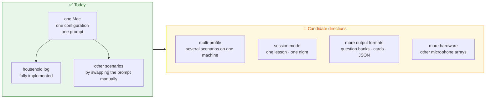

# Roadmap

**English** · [繁體中文](roadmap.md) · [Back to docs index](README.en.md)

> ⚠️ **This document describes direction, not commitment.** Nothing here has a guaranteed timeline, and priorities shift with real usage feedback. For what already exists, see the [README](../README.en.md) and the topic documents.

---

## Contents

- [Positioning: from household log to moment recorder](#positioning-from-household-log-to-moment-recorder)
- [Candidate directions](#candidate-directions)
- [What will not be built](#what-will-not-be-built)
- [How to influence priorities](#how-to-influence-priorities)

---

## Positioning: from household log to moment recorder

FamilyRecorder started from a very small problem: things said in the living room are forgotten ten seconds later.

After a while in real use, the pipeline's generality became obvious — **listen continuously → transcribe locally → tag time, speaker, and direction → organize with a prompt** has nothing intrinsically to do with households. Study review, dream journaling, and dictated notes all use the same path; only the organizing step differs.

The underlying capture, hallucination filtering, speaker labeling, and direction handling **do not need to change for new scenarios**. What is genuinely missing is making "one Mac serving several purposes" comfortable.

---

## Candidate directions

### 🎛️ Multi-profile support

**The problem:** one Mac currently holds one configuration. Running "household log in the living room" and "study sheet at the desk" together means editing prompts and thresholds back and forth by hand.

**What it might look like:** named profiles, each with its own `summary.prompt`, `common_terms`, VAD thresholds, and output directory; switchable from the menu bar, or selected automatically by time or device.

**Touches:** the `config.py` schema, the menu-bar UI, output paths in `storage.py`.

---

### 📚 Session mode

**The problem:** the unit today is "one summary per day". A 90-minute lesson, or a night that crosses midnight, is not a day.

**What it might look like:**
- An explicit "start / end a session" action, where a session's transcript becomes its own file and its own summary.
- Or a **configurable start-of-day time** (5 a.m., say), so 23:50 and 00:30 fall in the same "night".
- Separate summaries per session rather than one merged summary when a day has several.

**Touches:** date-based file splitting in `storage.py`, target selection in `summary.py`, the menu bar.

This is probably the limitation that scenario needs run into most often — both [study review](use-cases.en.md#scenario-2-tutoring-and-study-review) and [dream journaling](use-cases.en.md#scenario-3-dreams-and-night-time-ideas) mention it.

---

### 📤 More output formats

**The problem:** the only output today is Markdown. Study review wants a question bank or Anki deck; idea capture may want structured data for an existing notes system.

**What it might look like:** an optional second structured-extraction stage after the summary, using the same `--output-schema` mechanism that calendar candidates already use, emitting JSON, CSV, or an Anki import format.

**Touches:** the extraction pipeline in `summary.py` — the architecture already supports strict JSON Schema, so the cost is comparatively low.

---

### 🎙️ More hardware

**The problem:** the project is bound to the XVF3800 (VID `0x2886` / PID `0x001A`), and direction telemetry depends on its specific USB vendor-control protocol.

**What it might look like:**
- A **degraded mode** for ordinary USB microphones: no DoA and no Speech Energy, but capture, recognition, speaker labels, and summaries all work normally.
- An adapter layer for other arrays' direction protocols.

**Touches:** the scoring rules in `devices.py`, a protocol abstraction in `direction.py`.

> If you own another array and can share real routing and telemetry captures, that would help enormously.

---

### 🌏 Languages other than Chinese

**The problem:** the default prompt, the built-in placement-test sentences, and the menu-bar strings are all Traditional Chinese. `whisper.language` is configurable, but the overall experience is Chinese-first.

**What it might look like:** built-in multilingual prompt templates, multilingual placement-test sentences, and menu-bar localization.

> This one especially needs reports from real users — VAD thresholds, common-term correction behavior, and summary quality may differ substantially across languages.

---

### 📅 Other calendar and summary providers

- `calendar.provider` supports only `google` today (via macOS EventKit). iCloud and Outlook are not very different on top of EventKit; the work is mostly routing and display names.
- `summary.provider` supports only `codex`. **Any new provider must preserve the same boundary**: text only, no long-lived credential stored locally, and auditable invocation parameters.

---

### 🔍 A better audit view

Answering "why did that sentence not appear?" currently requires writing SQL. A plausible direction is a read-only view in the menu bar showing today's rejections and their reasons.

**Not planned:** a web dashboard (see below).

---

## What will not be built

These are not "not scheduled yet" — they are **deliberately excluded**, because they conflict with the project's core tradeoffs:

| Item | Why not |
|---|---|
| **Live cloud transcription** | It would send audio off this Mac, destroying the entire trust boundary |
| **Uploading or remotely backing up raw audio** | Same reason |
| **A web dashboard** | It needs a service, authentication, and network-reachable data. That conflicts with "everything stays local" |
| **Forensic voiceprints / identity verification** | Once a technology claims to verify identity, it gets used for access control and surveillance. Staying deliberately approximate |
| **Covert recording or hiding that recording is on** | Directly contradicts a consent-first premise |
| **Acting automatically on inferred tasks** | Tasks inferred from speech carry an error rate; acting on them turns recognition errors into real consequences |
| **Treating DoA as position or identity** | Direction is an angle, not a name or a coordinate |
| **Sentence blacklists** | Hallucinated text changes with the model and prompt, so a blacklist goes stale and creates false confidence |

Full reasoning in [privacy and trust boundaries → explicit non-goals](privacy.en.md#explicit-non-goals).

---

## How to influence priorities

Priorities here come from **actual use**, not from a feature list. The most useful feedback is:

| Kind of feedback | Why it helps |
|---|---|
| **"I use it for X and got stuck at Y"** | Pinpoints which limitation actually blocks people |
| **Reports from non-Chinese setups** | There is almost no real data on this today |
| **Real captures from other microphone arrays** | Routing and telemetry responses are nearly impossible to guess |
| **Prompt templates that work well** | They can go straight into the [use-case guide](use-cases.en.md) for everyone else |
| **Failures on the hardware acceptance checklist** | Any of the [31 items](development.en.md#acceptance-checklist) failing on your machine is a concrete bug |

Open an issue at [GitHub Issues](https://github.com/pcpcchen-coder/FamilyRecorder/issues), or read the [contributing guide](../CONTRIBUTING.en.md).

> ⚠️ Before reporting, remove transcript content, household member names, and your username from file paths.

---

## Related documents

- [Use-case guide](use-cases.en.md) — what is possible today
- [Architecture](architecture.en.md) — why some extensions are cheap and others are not
- [Privacy and trust boundaries](privacy.en.md) — which tradeoffs will not change
- [Contributing guide](../CONTRIBUTING.en.md) — how to get involved
