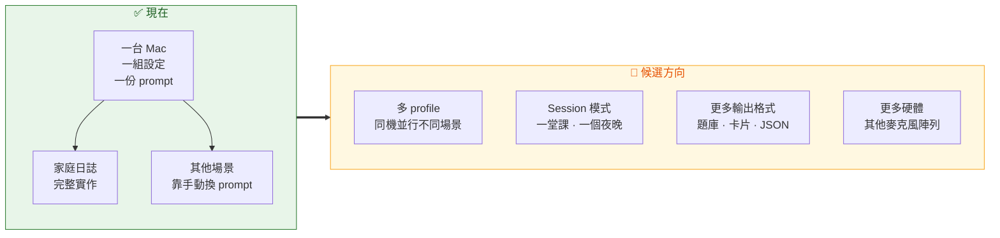

# 發展藍圖

[English](roadmap.en.md) · **繁體中文** · [返回文件索引](README.md)

> ⚠️ **這份文件描述的是方向，不是承諾。** 這裡沒有任何項目有保證的時程；優先順序會依實際使用回饋調整。已經實作的功能請看 [README](../README.md) 與各專題文件。

---

## 目錄

- [定位：從家庭日誌到當下記錄器](#定位從家庭日誌到當下記錄器)
- [候選方向](#候選方向)
- [不會做的事](#不會做的事)
- [怎麼影響優先順序](#怎麼影響優先順序)

---

## 定位：從家庭日誌到當下記錄器

FamilyRecorder 一開始是為了解決一個很小的問題：客廳裡說過的話，10 秒後就沒人記得。

實際使用一段時間後，這個管線的通用性變得明顯 —— **持續聆聽 → 本機辨識 → 標註時間／人／方向 → 依 prompt 整理**，這一整套跟「家庭」沒有必然關係。課後複習、夢境記錄、口述筆記，用的是同一條路徑，只是整理方式不同。

底層的收音、防幻覺、人別與方向**不需要為了新場景而改變**。真正缺的是讓「一台 Mac 服務多種用途」變得順手。

---

## 候選方向

### 🎛️ 多 profile 支援

**問題：** 目前一台 Mac 只能有一組設定。想同時做「客廳的家庭日誌」與「書桌的課後講義」，得手動改 prompt 與門檻，換來換去。

**可能的樣子：** 具名 profile，各自帶有自己的 `summary.prompt`、`common_terms`、VAD 門檻與輸出目錄；從選單列一鍵切換，或依時間／裝置自動選擇。

**牽涉到：** `config.py` 的 schema、選單列 UI、`storage.py` 的輸出路徑。

---

### 📚 Session 模式

**問題：** 目前是「一天一份摘要」。一堂 90 分鐘的課、一個跨午夜的夜晚，都不是「一天」這個單位。

**可能的樣子：**
- 明確的「開始／結束一個 session」動作，session 內的逐字稿獨立成檔並獨立摘要。
- 或者用**可設定的一日起點時間**（例如早上 5 點），讓 23:50 與 00:30 落在同一個「夜晚」。
- 一天多個 session 時，摘要分開產生而不是合併。

**牽涉到：** `storage.py` 的日期分檔邏輯、`summary.py` 的目標選擇、選單列。

這大概是目前最常被場景需求碰到的限制 —— [課後複習](use-cases.md#場景二家教與課後複習)與[夢境記錄](use-cases.md#場景三夢境與半夜靈感)都提到它。

---

### 📤 更多輸出格式

**問題：** 現在只產出 Markdown。課後複習想要的是題庫或 Anki 卡片；靈感記錄想要的可能是丟進既有筆記系統的結構化資料。

**可能的樣子：** 在摘要之後加上可選的第二階段結構化擷取（和目前行事曆候選事件用的 `--output-schema` 機制相同），輸出 JSON、CSV 或 Anki 匯入格式。

**牽涉到：** `summary.py` 的擷取管線 —— 這一塊的架構已經支援嚴格 JSON Schema，擴充成本相對低。

---

### 🎙️ 更多硬體

**問題：** 目前綁定 XVF3800（VID `0x2886` / PID `0x001A`）。方向遙測依賴其專屬的 USB vendor control 協定。

**可能的樣子：**
- 一般 USB 麥克風的**降級模式**：沒有 DoA 與 Speech Energy，但收音、辨識、人別、摘要都照常運作。
- 其他麥克風陣列的方向協定適配層。

**牽涉到：** `devices.py` 的評分規則、`direction.py` 的協定抽象。

> 如果你手上有其他陣列並願意提供 routing／telemetry 的實測資料，這會非常有幫助。

---

### 🌏 非中文語系

**問題：** 預設 prompt、內建擺位測試句、選單列文案都是繁體中文。`whisper.language` 可以改，但整體體驗仍以中文為主。

**可能的樣子：** 內建多語 prompt 範本、多語擺位測試句、選單列在地化。

> 這一項特別需要實際使用者的回報 —— 不同語言的 VAD 門檻、常用字詞校正行為與摘要品質可能差異很大。

---

### 📅 其他行事曆與摘要 provider

- `calendar.provider` 目前只支援 `google`（透過 macOS EventKit）。iCloud、Outlook 在 EventKit 之上其實差異不大，主要是路由與顯示名稱的處理。
- `summary.provider` 目前只支援 `codex`。**任何新 provider 都必須維持同樣的邊界**：只送純文字、不需要在本地保存長期憑證、可稽核的呼叫參數。

---

### 🔍 更好的稽核介面

現在要查「為什麼這句話沒出現」得自己下 SQL。可能的方向是在選單列加上一個唯讀的檢視，直接顯示今天的攔截記錄與原因。

**不會做的：** 網頁儀表板（見下方）。

---

## 不會做的事

這些不是「還沒排上」，而是**刻意不做**。它們與專案的核心取捨衝突：

| 項目 | 為什麼不做 |
|---|---|
| **即時雲端轉錄** | 會讓音訊離開這台 Mac，破壞整個信任邊界 |
| **上傳或遠端備份原始音訊** | 同上 |
| **網頁儀表板** | 需要開一個服務、處理認證，並讓資料可從網路存取。與「全部留在本機」相衝突 |
| **鑑識等級聲紋／身分驗證** | 這項技術一旦宣稱可用於驗證身分，就會被用在門禁、監護等場合。刻意保持「近似」 |
| **隱蔽錄音／隱藏收音狀態** | 直接違反同意優先的前提 |
| **自動執行推測出來的待辦** | 從語音推測的待辦有錯誤率；自動執行會把辨識錯誤變成真實後果 |
| **把 DoA 當成位置或身分** | 方向是角度，不是姓名或座標 |
| **句子黑名單** | 幻覺文字隨模型與提示改變，黑名單很快失效並產生虛假的安全感 |

完整說明見 [隱私與信任邊界 → 明確非目標](privacy.md#明確非目標)。

---

## 怎麼影響優先順序

這個專案的優先順序由**實際使用**決定，不是由功能清單決定。最有用的回饋是：

| 回饋類型 | 為什麼有用 |
|---|---|
| **「我用它做 X，卡在 Y」** | 直接指出哪個限制真的會擋到人 |
| **非中文語系的使用報告** | 目前這部分幾乎沒有實際資料 |
| **其他麥克風陣列的實測資料** | routing、telemetry 的實際 response 很難憑空推測 |
| **好用的 prompt 範本** | 可以直接進 [應用場景指南](use-cases.md) 造福其他人 |
| **實機驗收清單上的失敗** | [31 項清單](development.md#驗收清單)中任何一項在你機器上失敗，都是明確的 bug |

到 [GitHub Issues](https://github.com/pcpcchen-coder/FamilyRecorder/issues) 開一個 issue，或看 [貢獻指南](../CONTRIBUTING.md)。

> ⚠️ 回報時請先移除逐字稿內容、家庭成員姓名與檔案路徑中的使用者名稱。

---

## 相關文件

- [應用場景指南](use-cases.md) —— 今天已經能做到什麼
- [系統架構](architecture.md) —— 為什麼某些擴充成本低、某些高
- [隱私與信任邊界](privacy.md) —— 哪些取捨不會改變
- [貢獻指南](../CONTRIBUTING.md) —— 怎麼參與
