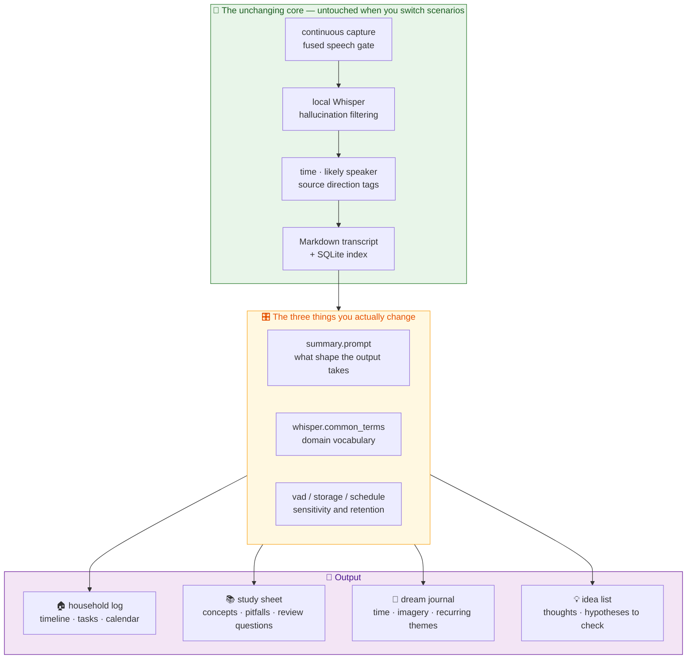

# Use-case guide

**English** · [繁體中文](use-cases.md) · [Back to docs index](README.en.md)

At its core FamilyRecorder is a general-purpose **moment recorder**: listen continuously → transcribe locally → tag time, speaker, and direction → organize with a prompt you control. The household voice log is simply the first profile.

This document covers **how to configure each scenario today**, **prompt templates you can paste**, and **the current capability limits**. Anything planned but not yet implemented is marked 🚧.

---

## Contents

- [The core idea: one pipeline, different ways to organize](#the-core-idea-one-pipeline-different-ways-to-organize)
- [Scenario 1: Household voice log](#scenario-1-household-voice-log--fully-implemented)
- [Scenario 2: Tutoring and study review](#scenario-2-tutoring-and-study-review--custom-prompt-is-enough)
- [Scenario 3: Dreams and night-time ideas](#scenario-3-dreams-and-night-time-ideas--custom-prompt-is-enough)
- [Scenario 4: Solo thinking-out-loud memos](#scenario-4-solo-thinking-out-loud-memos--custom-prompt-is-enough)
- [Adapting it to your own scenario](#adapting-it-to-your-own-scenario)
- [The ethics checklist every scenario shares](#the-ethics-checklist-every-scenario-shares)

---

## The core idea: one pipeline, different ways to organize



Switching scenarios requires **no code changes**. You change three things in the menu bar: the summary prompt, the common-terms list, and the sensitivity/schedule settings.

> ⚠️ One Mac currently holds **one configuration at a time**. Running "household log" and "study sheet" side by side on the same machine needs 🚧 [multi-profile support](roadmap.en.md) (planned).

---

## Scenario 1: Household voice log — ✅ fully implemented

**The problem:** "Remember to pick up the parcel tomorrow." "Parent-teacher meeting next Wednesday." Ten seconds later, nobody remembers.

**Setup:**

| Item | Suggested value | Why |
|---|---|---|
| Microphone placement | Geometric center of the conversation area, 5–15 cm above the surface | See [hardware and capture](hardware.en.md#mic-placement-test) |
| Household members | Every resident, 15 seconds of enrollment each | Lets the summary group by person |
| Direction calibration | Calibrate the most-used seat as the room front | Makes direction labels meaningful |
| `vad.min_speech_ratio` | `0.08` (default) | A good balance at living-room distance |
| `storage.keep_audio_days` | `7` (default) | You can still listen back when something looks wrong |
| Summary schedule | `00:10`, summarizing yesterday (default) | Ready when you wake up |
| Google Calendar | Start with per-event confirmation | Move to automatic only once you trust the quality |

**Output:** event timeline, per-member highlights, important news, decisions and commitments, tasks, ideas worth following up, key entities, segments needing human review, a 100-character summary, and Google Calendar candidate events.

See [Daily summary and calendar](daily-summary.en.md) for full details.

---

## Scenario 2: Tutoring and study review — 🟡 custom prompt is enough

**The problem:** After a one-hour tutoring session the student remembers fragments. The mistake the teacher emphasized, the concept explained twice, the question asked on the spot — all of it stays in the room.

### Setup

1. **Placement.** Put the array in the middle of the desk with teacher and student on opposite sides. Use [direction calibration](hardware.en.md#direction-calibration) to make the teacher's seat the room front — then angles near `0°` in the transcript are the teacher and angles near `180°` are the student.
2. **Enroll voice samples.** Add the teacher and the student as household members and record 15 seconds each, so timbre still separates them when they move.
3. **Add subject vocabulary.** In "常用字詞校正" (common-term correction), add this subject's terminology line by line — `二次函數`, `判別式`, `photosynthesis`, `mitochondria`. These enter the local Whisper prompt and noticeably reduce errors on domain terms.
4. **Tune sensitivity.** One-on-one tutoring is close-range and steady, so you can raise `vad.min_speech_ratio` a little (say `0.12`) to reject room noise; lower it to `0.05` if the teacher speaks softly.
5. **Replace the summary prompt.** Menu bar → "更換模型 → ChatGPT 摘要" → paste the template below.
6. **Summarize right after class.** The scheduled job summarizes **yesterday**. For a study sheet immediately after the session, use "立即整理今天" (summarize today now) in the menu bar.

### Prompt template

```text
You are a study-sheet assistant. The input is a classroom transcript produced
by on-device speech recognition; it contains typos, repetitions, room noise,
and meaningless fragments. Organize strictly from the transcript. Never invent
questions, concepts, or conclusions. Output Markdown containing:

1. Lesson outline in chronological order, each item tagged "around HH:MM"
2. Core concepts, each with its definition, preconditions, and scope
3. Points the teacher emphasized or repeated more than once
4. Pitfalls and common misconceptions raised during the lesson
5. Questions the student actually asked, and the answers given
6. Anything left unresolved or deferred to a later session
7. Five review questions from easy to hard, each with a reference answer and
   the lesson timestamp it came from
8. A glossary: term — how it was explained in class
9. Domain terms that were probably misrecognized and need human confirmation
10. A summary of the lesson in 100 words or fewer

Treat segments labeled "可能：<teacher>" as instruction and "可能：<student>"
as questions or answers. Speaker labels are approximate local matches, not
verified identities; do not force uncertain or unlabeled segments onto either
side. Review questions must be based only on material actually covered in the
transcript — never introduce concepts that did not appear in class.
```

> Replace `<teacher>` and `<student>` with the names you actually entered as household members.

### What works today vs. what does not

| | Status |
|---|---|
| Full transcript with timestamps | ✅ |
| Teacher and student separated (timbre + direction) | ✅ |
| Subject terminology correction | ✅ |
| Concepts, pitfalls, and review questions | ✅ via the prompt above |
| A study sheet immediately after class | ✅ via "summarize today now" |
| **Multiple lessons in one day kept separate** | 🚧 One summary per day — several lessons get merged |
| **Automatically switching prompts per subject** | 🚧 Needs multi-profile |
| **Export to a question bank or Anki deck** | 🚧 Markdown only today |
| **Reading a whiteboard or slides** | ❌ Audio-only project by design |

Workaround for multiple lessons: **pause** recording between sessions from the menu bar, or run "summarize today now" right after each lesson and save a copy of `summaries/YYYY-MM-DD.md` yourself — re-running the same day overwrites that file.

### Additional care

- **Both the student and their guardian must consent.** You are recording a minor's learning performance and questions, which is sensitive material. Get agreement from the teacher, the student, and the guardian before starting.
- If you plan to send transcripts for cloud summarization, confirm that the tutor agrees too. You can keep everything local by setting `summary.enabled: false`.
- This system **must not** be used to evaluate a teacher's performance or as evidence in a dispute. Speaker labels are approximations, not defensible identification.

---

## Scenario 3: Dreams and night-time ideas — 🟡 custom prompt is enough

**The problem:** A dream evaporates within minutes of waking. Turning on a light, unlocking a phone, opening an app — that process alone is enough to lose it.

FamilyRecorder suits this unusually well: **silent stretches produce no WAV and never reach Whisper**, so an eight-hour night leaves behind only the few dozen seconds you actually spoke. Say one sentence half-asleep and go back to sleep.

### Setup

1. **Placement.** On the nightstand, 40–60 cm from your head. Further away pushes quiet speech below the gate.
2. **Lower the thresholds.** Half-asleep speech is far quieter than daytime conversation. A starting point:

   ```yaml
   vad:
     min_speech_ratio: 0.04    # default 0.08
     min_rms_dbfs: -54.0       # default -48.0
   direction:
     speech_energy_min_rms_dbfs: -60.0   # default -55.0
   ```

   Watch `captures.gate_reason` for a few nights, then tighten back up. Method in [troubleshooting](troubleshooting.en.md#everything-keeps-getting-skipped-by-vad).

3. **Set hallucination filtering to relaxed.** A quiet room plus mumbled speech is the combination most likely to be over-rejected by strict mode. Start relaxed and check what was rejected:

   ```bash
   sqlite3 "$HOME/xvf3800-listener-data/listener.sqlite3" \
     "select started_at, decision, reason, raw_text from transcription_audits
      where date(started_at) = date('now','localtime') order by id desc limit 20;"
   ```

4. **Turn calendar candidates off.** Dream content should not become calendar events. Confirm `calendar.enabled: false`.
5. **Keep audio longer.** Mumbled speech has a high error rate, so keep the WAVs to verify: `storage.keep_audio_days: 14`.
6. **Replace the summary prompt.**

### Prompt template

```text
You are a dream and night-time idea journal assistant. The input is a
transcript of night-time recordings produced by on-device speech recognition.
The speaker had just woken up and was not speaking clearly, so typos and
sentence-boundary errors are frequent. Organize strictly from the transcript.
Never invent plot, characters, or symbolic meaning. Output Markdown containing:

1. A timeline of the night's entries, each tagged "around HH:MM"
2. The content of each entry, preserving the original wording and tone as much
   as possible, correcting only obvious transcription errors
3. People, places, objects, or situations that recur across entries
4. Emotional tone — only when the transcript explicitly describes emotion
5. Fragments that are probably tasks or ideas rather than dreams, listed separately
6. Fragments whose recognition quality is poor enough to need listening back,
   with their timestamps
7. A summary of the night in 100 words or fewer

Do not interpret dreams. Do not analyze psychological meaning. Do not infer
symbolism. Your job is to **preserve**, not to interpret. Where the transcript
is incoherent, keep it as-is and mark it "incomplete" rather than smoothing it
into a coherent story.
```

### What works today vs. what does not

| | Status |
|---|---|
| A whole night leaving only what you actually said | ✅ Exactly what the fused gate is for |
| No lights, no phone | ✅ |
| Timestamped dream entries | ✅ |
| Recurring imagery | ✅ via the prompt above |
| **Getting the write-up the same morning** | ⚠️ The scheduled job summarizes **yesterday**. Use "summarize today now" from the menu bar, or schedule `summary --date $(date +%F)` yourself |
| **One night merged into one entry across midnight** | 🚧 Things said at 23:50 and 00:30 land in two different date files |
| **Correlation with sleep stages or biometrics** | ❌ Out of scope |

**Workaround across midnight:** run `summary --date` once for each of the two days, or shift your bedtime recording earlier. 🚧 A configurable "start of day" is on the [roadmap](roadmap.en.md).

### Additional care

- **The consent bar is higher in a bedroom.** If a second person is in the room, explicit agreement is mandatory — sleep talk is not a conscious act of expression.
- Dream content is often extremely private. **Seriously consider disabling cloud summaries entirely** (`summary.enabled: false`) and keeping only local transcripts, or using a separate ChatGPT account unconnected to work and family.
- Breathing, turning over, and a partner's snoring can all trip the gate. If noise chunks pile up, raise `min_rms_dbfs` rather than disabling hallucination filtering.

---

## Scenario 4: Solo thinking-out-loud memos — 🟡 custom prompt is enough

**The problem:** The most complete version of an idea arrives while washing dishes, walking, or driving — and the 30 seconds it takes to open a phone is enough to lose it.

**Setup:** enroll only yourself (speaker labels still help — they flag audio that is **not** you, such as a television or a visitor). Direction can be turned off (`direction.enabled: false`) to drop the USB dependency. Point the summary prompt at idea capture: group by theme, mark actionable next steps, mark assumptions that need verification, and flag ideas that contradict each other.

**Good for:** dictated notes in a home studio, thinking out loud during research, a personal daily voice log.

**Note:** if you live alone and record only yourself, consent is simple — but the moment a visitor walks in, the recording involves them. Put a visible recording notice on the desk or by the door, and use the menu bar **pause** during visits.

---

## Adapting it to your own scenario

### What configuration alone can change

| What you want to change | Where |
|---|---|
| The output format | `summary.prompt` (visual editor in the menu bar) |
| Domain vocabulary | `whisper.common_terms` |
| Language | `whisper.language`, `whisper.initial_prompt`, and the output language in the prompt |
| Capture sensitivity | `vad.*`, `direction.speech_energy_*` |
| The false-reject vs. missed-speech tradeoff | `hallucination_filter.*` (three presets, or field by field) |
| How long audio is kept | `storage.keep_audio_days`, `delete_audio_after_transcription` |
| When summarization runs | `summary.hour` / `summary.minute` |
| Whether the calendar is used | `calendar.enabled`, `calendar.auto_create` |

Full field reference in [configuration](configuration.en.md).

### What requires code changes

- A different microphone array (the scoring rules in `devices.py` and the USB protocol in `direction.py`)
- A calendar provider other than Google (`calendar.provider` currently supports only `google`)
- A summary backend other than Codex/ChatGPT (`summary.provider` currently supports only `codex`)
- Output formats beyond a transcript — generating Anki cards or a question-bank JSON directly, for example

Issues and pull requests for any of these are welcome; see the [contributing guide](../CONTRIBUTING.en.md).

---

## The ethics checklist every scenario shares

Before you install, confirm every line:

- [ ] **Everyone who might be recorded knows, and agrees.** Not only residents — visitors, tutors, and repair technicians count too.
- [ ] **The recording is visible.** The device sits in plain sight, with a written notice where appropriate.
- [ ] **There is an obvious way to turn it off, and everyone knows how.** Teach the whole household the menu bar pause.
- [ ] **Local law permits it.** Rules on recording consent (one-party vs. all-party) vary widely by jurisdiction.
- [ ] **Minors are covered by guardian consent, and know about it themselves.**
- [ ] **Everyone re-confirms before cloud summaries are enabled.** Transcript text leaves this Mac.
- [ ] **It will not be used to monitor anyone.** This system is not for attendance tracking, parental surveillance, checking up on a partner, or any form of one-sided monitoring.

FamilyRecorder **deliberately provides no** covert-recording capability, and must not be used where verified identity matters — access control, payments, or legal evidence. Speaker labels are approximations, and direction is an angle rather than a name.

Full detail in [Privacy and trust boundaries](privacy.en.md).
