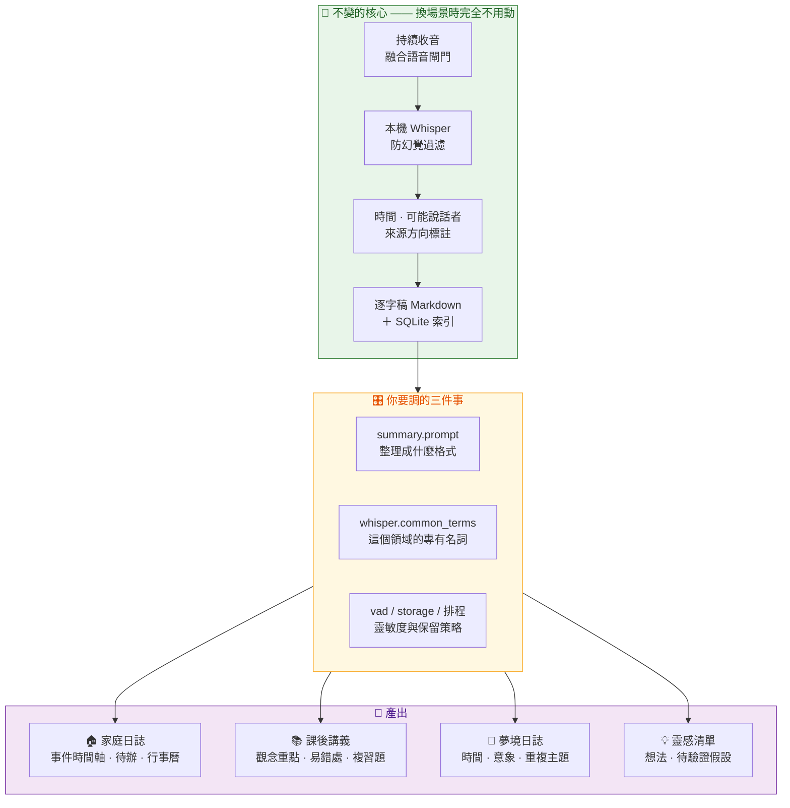

# 應用場景指南

[English](use-cases.en.md) · **繁體中文** · [返回文件索引](README.md)

FamilyRecorder 的核心是一個通用的**「當下記錄器」**：持續聆聽 → 本機辨識 → 標註時間／人／方向 → 依你自訂的 prompt 整理。家庭聲音日誌只是第一個 profile。

這份文件說明每個場景**今天就能怎麼設定**、**建議的 prompt 範本**，以及**目前的能力邊界**。規劃中但尚未實作的功能，一律標示為 🚧。

---

## 目錄

- [核心概念：同一套管線，不同的整理方式](#核心概念同一套管線不同的整理方式)
- [場景一：家庭聲音日誌](#場景一家庭聲音日誌--完整實作)
- [場景二：家教與課後複習](#場景二家教與課後複習--自訂-prompt-即可)
- [場景三：夢境與半夜靈感](#場景三夢境與半夜靈感--自訂-prompt-即可)
- [場景四：一人思考語音備忘](#場景四一人思考語音備忘--自訂-prompt-即可)
- [怎麼把它改成你自己的場景](#怎麼把它改成你自己的場景)
- [每個場景通用的倫理檢查](#每個場景通用的倫理檢查)

---

## 核心概念：同一套管線，不同的整理方式



換場景時**不需要改任何程式碼**。你要改的是選單列上的三個地方：摘要 prompt、常用字詞、以及靈敏度與排程設定。

> ⚠️ 目前一台 Mac **同時只能有一組設定**。想在同一台機器上並行「家庭日誌」與「課後講義」兩種整理方式，需要 🚧 [多 profile 支援](roadmap.md)（規劃中）。

---

## 場景一：家庭聲音日誌 — ✅ 完整實作

**問題：** 客廳裡隨口說的「明天記得幫我拿包裹」「下週三家長會」，說完 10 秒後就沒人記得。

**設定：**

| 項目 | 建議值 | 為什麼 |
|---|---|---|
| 麥克風擺位 | 談話區幾何中心、離桌面 5–15 cm | 見 [硬體與收音](hardware.md#mic-placement-test) |
| 家庭成員 | 全部常住成員，各錄 15 秒樣本 | 讓摘要能分組 |
| 方向校準 | 把最常坐的位置校準為正前方 | 方向標籤才有意義 |
| `vad.min_speech_ratio` | `0.08`（預設） | 客廳距離下的平衡點 |
| `storage.keep_audio_days` | `7`（預設） | 出錯時還能回聽 |
| 摘要排程 | `00:10` 整理昨天（預設） | 早上起床就有 |
| Google Calendar | 先用逐筆確認 | 熟悉品質後再考慮自動 |

**產出：** 事件時間軸、家庭成員重點、今日重要消息、決策與承諾、待辦事項、值得追蹤的想法、關鍵實體、需人工確認的片段、100 字摘要，以及可加入 Google Calendar 的候選事件。

完整說明見 [每日摘要與行事曆](daily-summary.md)。

---

## 場景二：家教與課後複習 — 🟡 自訂 prompt 即可

**問題：** 一小時的家教課，學生課後只記得片段。老師強調的易錯處、講過兩次的觀念、當場的提問，全都留在教室裡。

### 設定步驟

1. **擺位。** 把陣列放在書桌中央，老師與學生分坐兩側。用 [方向校準](hardware.md#方向校準) 把老師的位置設為正前方 —— 這樣逐字稿裡 `0°` 附近是老師，`180°` 附近是學生。
2. **註冊聲音樣本。** 在「家庭成員與人聲」把老師與學生各加為一位成員，各錄 15 秒。這樣即使兩人換位置，音色仍能區分。
3. **加入科目術語。** 在「常用字詞校正」逐行加入這一科的專有名詞（例如 `二次函數`、`判別式`、`光合作用`、`Mitochondria`）。這些字詞會進入本機 Whisper 提示，明顯降低專有名詞的辨識錯誤。
4. **調整靈敏度。** 一對一教學距離近、音量穩定，可以把 `vad.min_speech_ratio` 稍微調高（例如 `0.12`）減少環境雜訊誤觸；反之若老師講話輕聲，調低到 `0.05`。
5. **換掉摘要 prompt。** 選單列 →「更換模型 → ChatGPT 摘要」→ 貼上下面的範本。
6. **課後立刻整理。** 排程的每日摘要整理的是**昨天**；課後想馬上要講義，請用選單列的「立即整理今天」。

### 建議 prompt 範本

```text
你是課後複習講義整理助手。輸入是本地端語音辨識產生的課堂逐字稿，
可能有錯字、重複、環境音或無意義片段。只根據逐字稿內容整理，
不得補造題目、觀念或結論。請輸出繁體中文 Markdown，包含：

1. 本堂課大綱（依時間先後，每項標示「約 HH:MM」）
2. 核心觀念整理（每個觀念寫清楚定義、成立條件與適用範圍）
3. 老師特別強調或重複超過一次的重點
4. 課堂中出現的易錯處與常見誤解
5. 學生實際提出的問題，以及當場給的回答
6. 尚未解決或老師說「下次再講」的項目
7. 複習題 5 題（難度由淺到深），每題附上參考答案與對應的課堂時間
8. 關鍵名詞表（名詞 — 課堂中的說明）
9. 逐字稿中可能辨識錯誤、需要人工確認的專有名詞
10. 100 字內的本堂課摘要

逐字稿標記「可能：老師」的段落請視為授課內容，「可能：學生」視為
提問或回答。人別是本機近似辨識結果，不是確認身分；不確定或未標記
的段落不要硬分配給任何一方。複習題必須完全根據逐字稿實際講過的
內容出題，不得引入課堂上沒有出現的觀念。
```

> 把 `老師`／`學生` 換成你在「家庭成員」裡實際填的名字。

### 今天做得到 vs. 還做不到

| | 狀態 |
|---|---|
| 完整逐字稿含時間戳 | ✅ |
| 老師／學生分開（音色＋方向雙線索） | ✅ |
| 科目專有名詞校正 | ✅ |
| 觀念重點、易錯處、複習題整理 | ✅ 靠上面的 prompt |
| 課後立即產生講義 | ✅ 用「立即整理今天」 |
| **一天多堂課自動分開** | 🚧 目前一天一份摘要，多堂課會混在一起 |
| **依課程自動切換 prompt** | 🚧 需要多 profile |
| **匯出成題庫或 Anki 卡片** | 🚧 目前只有 Markdown |
| **辨識白板或投影片內容** | ❌ 純語音專案，不做影像 |

一天多堂課的暫時解法：課間用選單列**暫停**錄音，或每堂課後立刻「立即整理今天」並自行把 `summaries/YYYY-MM-DD.md` 另存 —— 重跑同一天會覆寫該檔。

### 額外注意

- **學生與家長都要知情同意。** 錄下的是一位未成年人的學習表現與提問，屬於敏感內容。開始前請取得老師、學生與家長三方同意。
- 若要把逐字稿送雲端摘要，請先確認家教老師也同意。你可以只用本機逐字稿（把 `summary.enabled` 設為 `false`），完全不啟用雲端。
- 這套系統**不能**用來評估老師表現或做為爭議時的證據；音色人別是近似結果，不是可採信的身分認定。

---

## 場景三：夢境與半夜靈感 — 🟡 自訂 prompt 即可

**問題：** 夢境在醒來後幾分鐘內就會忘光。開燈、解鎖手機、打開 App 打字 —— 這個過程本身就足以把夢弄丟。

FamilyRecorder 特別適合這件事：**安靜的時段不會產生任何 WAV，也不會進 Whisper**，所以整晚 8 小時只留下你真的開口說話的那幾十秒。你只要在半夢半醒之間說一句話，然後繼續睡。

### 設定步驟

1. **擺位。** 放在床頭櫃，離頭部約 40–60 cm。太遠會讓輕聲說話落到閘門之下。
2. **調低靈敏度門檻。** 半夢半醒的說話音量遠低於日常對話。建議起點：

   ```yaml
   vad:
     min_speech_ratio: 0.04    # 預設 0.08
     min_rms_dbfs: -54.0       # 預設 -48.0
   direction:
     speech_energy_min_rms_dbfs: -60.0   # 預設 -55.0
   ```

   調整後觀察幾晚的 `captures.gate_reason`，再往回收緊。方法見 [疑難排解](troubleshooting.md#一直被-vad-略過)。

3. **防幻覺改成「寬鬆」。** 安靜房間 ＋ 含糊的說話，是最容易被嚴格模式誤攔的組合。先用寬鬆，並定期檢查 `transcription_audits` 看看攔掉了什麼：

   ```bash
   sqlite3 "$HOME/xvf3800-listener-data/listener.sqlite3" \
     "select started_at, decision, reason, raw_text from transcription_audits
      where date(started_at) = date('now','localtime') order by id desc limit 20;"
   ```

4. **關掉行事曆候選。** 夢境內容不該變成日曆事件。確認 `calendar.enabled: false`。
5. **延長音訊保留。** 含糊的語音辨識錯誤率高，保留 WAV 才能回聽確認：`storage.keep_audio_days: 14`。
6. **換掉摘要 prompt。**

### 建議 prompt 範本

```text
你是夢境與夜間靈感日誌整理助手。輸入是本地端語音辨識產生的夜間
錄音逐字稿，說話者剛睡醒、口齒不清，因此錯字與斷句錯誤很多。
只根據逐字稿內容整理，不得補造情節、人物或象徵意義。
請輸出繁體中文 Markdown，包含：

1. 夜間記錄時間軸（每則標示「約 HH:MM」，依時間排列）
2. 每則記錄的內容整理（盡量保留原本的用字與語氣，只修正明顯錯字）
3. 反覆出現的人物、地點、物件或情境
4. 情緒基調（只在逐字稿中確實有情緒描述時才寫）
5. 可能不是夢境、而是待辦或靈感的片段（另外分開列出）
6. 辨識品質很差、需要回聽原始錄音確認的片段（標示其時間）
7. 100 字內的今夜摘要

不要解夢，不要分析心理意義，不要推測象徵。你的工作是**保存**而不是
詮釋。逐字稿若語意不完整，就照實保留並標示「內容不完整」，
不要自行補成通順的故事。
```

### 今天做得到 vs. 還做不到

| | 狀態 |
|---|---|
| 整晚只留下真的開口的片段 | ✅ 這正是融合閘門的設計目的 |
| 不用開燈、不用碰手機 | ✅ |
| 帶時間的夢境記錄 | ✅ |
| 重複意象整理 | ✅ 靠上面的 prompt |
| **當天早上就拿到整理** | ⚠️ 排程摘要整理的是**昨天**；請用選單列「立即整理今天」，或自行排程 `summary --date $(date +%F)` |
| **跨午夜的一個夜晚合併成一份** | 🚧 23:50 與 00:30 說的話會落在兩個不同日期的檔案 |
| **睡眠階段或生理訊號關聯** | ❌ 非本專案範圍 |

**跨午夜的暫時解法：** 想要「一晚一份」，可以手動對兩天各跑一次 `summary --date`，或把睡前的記錄時間往後推。🚧 可設定的「一日起點時間」在 [藍圖](roadmap.md) 上。

### 額外注意

- **臥室錄音的同意門檻更高。** 若房間內有第二個人，必須取得對方明確同意；夢話與睡眠中的發言，當事人並非有意識地表達。
- 夢境內容往往極度私密。**認真考慮完全關閉雲端摘要**（`summary.enabled: false`），只保留本機逐字稿；或用一個與工作、家庭無關的獨立 ChatGPT 帳號。
- 睡眠呼吸聲、翻身聲、伴侶的鼾聲都可能觸發閘門。如果雜訊 chunk 太多，先調高 `min_rms_dbfs` 而不是關掉防幻覺。

---

## 場景四：一人思考語音備忘 — 🟡 自訂 prompt 即可

**問題：** 洗碗、走路、開車時想到的東西最完整，但打開手機打字的那 30 秒就足以讓它跑掉。

**設定：** 只註冊自己一位成員（人別標註仍有用 —— 它會標出**不是**你的聲音，例如電視或訪客）。方向功能可以關掉（`direction.enabled: false`）以省去 USB 相依。摘要 prompt 換成靈感整理格式：依主題分組、標出可執行的下一步、標出需要查證的假設、標出前後矛盾的想法。

**適合：** 居家工作室的口述筆記、研究過程的 thinking out loud、獨居者自己的日常語音日誌。

**注意：** 若你獨居、只錄自己，同意問題最單純；但只要有訪客進門，錄音就涉及對方。建議在門口或桌上放一個明顯的收音標示，並在選單列用**暫停**功能處理訪客時段。

---

## 怎麼把它改成你自己的場景

### 只改設定就能做到的

| 想改的東西 | 改哪裡 |
|---|---|
| 整理成什麼格式 | `summary.prompt`（選單列可視覺化編輯） |
| 領域專有名詞 | `whisper.common_terms` |
| 語言 | `whisper.language`、`whisper.initial_prompt`，以及 prompt 的輸出語言 |
| 收音靈敏度 | `vad.*`、`direction.speech_energy_*` |
| 誤攔 vs. 漏字的取捨 | `hallucination_filter.*`（三段預設或逐項調整） |
| 保留多久音訊 | `storage.keep_audio_days`、`delete_audio_after_transcription` |
| 什麼時候整理 | `summary.hour` / `summary.minute` |
| 要不要行事曆 | `calendar.enabled`、`calendar.auto_create` |

完整欄位說明見 [設定參考](configuration.md)。

### 需要改程式的

- 不同的麥克風陣列（`devices.py` 的評分規則與 `direction.py` 的 USB 協定）
- 除了 Google Calendar 以外的行事曆 provider（`calendar.provider` 目前只支援 `google`）
- 除了 Codex／ChatGPT 以外的摘要後端（`summary.provider` 目前只支援 `codex`）
- 逐字稿以外的輸出格式（例如直接產生 Anki 卡片或題庫 JSON）

歡迎為以上任何一項開 issue 或 PR，見 [貢獻指南](../CONTRIBUTING.md)。

---

## 每個場景通用的倫理檢查

在按下安裝之前，逐項確認：

- [ ] **所有可能被錄到的人都知道，而且同意。** 不只是同住者 —— 訪客、家教老師、維修人員也算。
- [ ] **收音是可見的。** 裝置放在看得到的地方，必要時加上文字標示。
- [ ] **有明確的關閉方式，而且大家都知道怎麼用。** 選單列的暫停功能要教會家裡每個人。
- [ ] **當地法律允許。** 各地對於錄音同意（單方同意 vs. 全體同意）的規定差異很大。
- [ ] **未成年人由監護人同意，而且本人也知情。**
- [ ] **啟用雲端摘要前，全體再確認一次。** 逐字稿文字會離開這台 Mac。
- [ ] **不會用來監控任何人。** 這套系統不適用於考勤、家長監控、伴侶查勤或任何形式的單方監視。

FamilyRecorder **刻意不提供**隱蔽錄音功能，也不應該被用在需要確認身分的場合（門禁、付款、法律證據）。音色人別是近似結果，方向是角度而不是姓名。

完整說明見 [隱私與信任邊界](privacy.md)。
